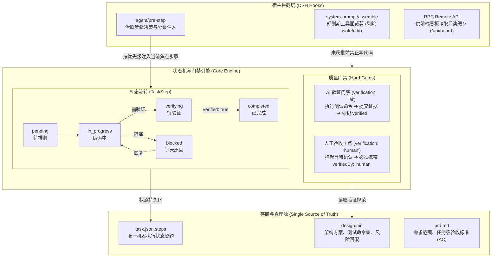

# dsh-trellis

<div align="center">
  <b style="font-size: 1.3em;">Trellis 工作流扩展 · DeepSeek Harness</b><br />
  <sub>规划期只读保护 · 5 态步骤状态机 · AI / 人工双层验证门禁 · 单一真理源</sub><br /><br />
  <a href="https://opensource.org/licenses/MIT"></a>
  
  
  
  
</div>

<div align="center">
  🌏 <a href="./README.md"><b>中文</b></a> · <a href="./README_EN.md">English</a>
</div>

<br />

<p align="center">
  
  
</p>

---

## 项目定位

`dsh-trellis` 是为 [DeepSeek Harness (DSH)](https://github.com/deepseek-ai/deepseek-harness) 开发的工程化工作流插件，基于 [Trellis](https://github.com/mindfold-ai/trellis) 的阶段规范与状态机思想重构。

它通过宿主生命周期拦截，解决大模型在长程编程中的三类典型问题：
1. **方案未定即盲目写码**：通过底层工具面物理裁剪，在方案获批前封锁写入权限；
2. **任务清单多头维护**：废弃分散在各产物中的平行列表，以 `task.json.steps` 为唯一执行真理源；
3. **缺乏质量验收约束**：引入 5 态状态机与两阶段提交，区分 AI 自动化测试与人工确认卡点，拦截未经验证的代码合流。

---

## 架构设计

系统由宿主拦截层、状态机引擎层与存储层构成：



- 📄 **Draw.io 架构图源文件**：[`docs/images/architecture.drawio`](./docs/images/architecture.drawio)
- 🌐 **在线查看**：[在 diagrams.net 查看](https://viewer.diagrams.net/?tags=%7B%7D&lightbox=1&edit=_blank#R5V1bc5tIFv4t%2B0Ct%2FWCXuAoeQUKTqcpMZuPszs6TCqG2zFgCFUKxvb9%2B%2B5zTDQ20LnYUW06clI0aaBr4ztfn2jLskWFPHldLwxp8ZeUmK3LDHhuWZV4P%2BG%2FeyvK0mGf5gpr%2F%2FWVy5cMOe2LYsTEIDXu0erzNlowfeldsKjpsXiYPWUEdtLq1vOsB9UxnWwP4b4%2FmWbIokxX%2FkCcrRsd%2BKdlymW2uwjK9yyqWVtuSUZfZnI6oxBEJP%2BLK7PYq%2B149%2FlIm67vfijmD25w%2Fijt0LHGL8ydq8X3RsCjlFcym4Sb7nxiYKQ%2FbZnO2aR1YFcWyytbtxrTIcz78VltSlsVD%2B7DbYtm%2B6jpZsF7DTZos%2B61%2FZvPqTrRag0Gz4wPLFnfi0oHcMUvS%2B0VZbHNxPcOyb%2FFH%2FwjlgyyLotq5u3naI%2F5SlJckrmlYk%2BefW99hyfJqR3d7e%2FzH1RVujJ%2F93xp8DP%2BKP%2FO%2FpmHDJcaMrW8Yu%2BebH5IyZ5sNbAHk4WIe%2F%2F1rXrEyZeuqKDcvviof8LMf0zJ5YuUUxY9ELlluBUa0ozZi1whjI5oYsWNEvhFFRuzDx2AAG6Fp%2BCMj9oxgaEQe3V6yWht2hOcGRmAZYYCdjPEUz%2FAjI%2FRwg58ewq6IdwJjuRCP6PM2r7IV6%2FT2oSjuN5c06k31JJG9echWyyTnn6JNlZSVkD3L5w2IWwZ3zl9MxEVf7PT4J05Ey1GxLErsxr4d3Doc1NBJWdwzZY%2BX%2BmwGe26LvLoRFzblZ%2BrQdMRn5TyT2XM34O1psVwm6002wzMHeDeC7Sr2uBO95j4J69EWK1asKp%2F4Z9GjI9D%2F1P74oEi%2FKSXkTpH8mrISQTmLuutjZZMfI3B3hNj1EHrH3%2FM02WzYCh5YF6SGG22eNhVbXa3LYrXmcJnUx7pjFC77MYFnHA8NP0DwDQF5vodQGxqhCxs%2BbgNAx0ZoIZRtwzdxV4C47GG36fviM0vmV0W%2BhOf9hfM4%2F%2FNHuc1Z2cdnG4MPMD3drJMU9j7wuYa33VV8ThWQ6oDST1ma6kA5813HHXRAaO0AqXLeMDFT0z8Wgm2yeDkW7TYW3T4WLR0Uh%2BeAxHXJONzWOiDyOTMHAPJDrvCYDgA94EaOJiDMMbAobwlHwJkN7lw8xhU0GJhwTGQboS9ACmjdh8So5FBMy%2B1q1qHLGxw0n2j%2B5vpEcWJgzhPm36aH2fJ4YJoz23Pnrw%2FMw8h0zhCZ5Tqd8vdXcZWyi8vPf4xgCmWrooIZNPzjV5yJ%2BQzNcTZGVIUAwQ5ThjB9A2IHyIIeQDHwkRc9aKG7gp6G2BPCm2MYFAO%2BwdFLkzvivDmY6wwjIwixnwkcz0%2FnKkRgCr2C71LADGS%2BzvjvWZGUc8MaUU%2BiLcvnp0UxM%2BcuG%2BpQHHhDO%2FGej2J7ZjLXeW0Uu8H7RPFyuZoKDu2SK6DDMcKhAA6nPdjwAZ5Aoqh48mOCGJDIUU690M4B6KnApxPDt1V4ffz4G4pGsilyMFPbhBk%2FsnRbcfPzsiUbXF4moN0CcEOhuXIcBxOUhNDwHYWyPfjIjycpCyKhNPuxTvfwQWb4CKEfB04%2Fqepwe2vpVYe5N%2FPcF2DbTe35YPDa2K4N7T3YNs8Q29zaT7nuwHVCDbg5gjhkAkSrCXZQTYYcCyGaV6SHAmFPJIXq9FnewrEDGkIAAsOfS5kB70%2FYPKvEucJAGwNvC%2FodI1TJiKsvNATARjQ8B4fnwMEhIjTEeaEtGP0hw7hiZcjUU6xYiqTU%2BDBkfyhFxYPh9yWkKw8cb1UH9AqENZD18AdMv2W2ALdSysDu5g2A3ixNlqHYURXrHSL2loqyaR%2BpKbvngPYMVU0tl3N4cRUB4D7GN%2BwDmASmHSRVAZnZskjvOeUhNS8qYuYs55JULErhkWh28LeS3T4hlbcZ2xMqNajLvqTuIe6K0YVB6FOli8A70ilDKF0kIaIfcoWEyq0prhAhVwHi2lKEMIDBRPRAfJwCyPcx%2BSmRfgTUnXOFOte%2FNThHM69B10QoD6FUf6Nd4OQItJWWGjAKNYcR9NCYlAFq4dKh5gdSUfFaohAgpXuwwY3NYCz0qsATc5A%2FFCSPvjtuKUw%2BCZ9fRL3j9CKn4J8KoF2l%2Bn0BdLdaXfNV7ZLYqbv2WdoB0hPa7FiAVkC05nb0noEu0vKEBKhCkB7iWwisCVw5tiXLkqY8Fu5lUpCFi9humJj%2FjlyhfPioRgSof4CIkKH60yG1qyJrkWq%2BFlK%2Fe4zFohiLCPnxrVEBwb5BnC%2BynL1BMIWJC3eErRkggtNEaauVZlQuQq1ZieRL6hKXMD%2FWGbWDizHjoFxlebbhmOQNfxbl%2Fe2yeOhYtb8kFZm69Hi%2BX%2FzE5Ranq7M3fWtme94L4iczxzbZucRPrODoAIr%2FuhMAyZR7dVMl6PH7LUnvSBButrOrqHh8IbhnxeN0A32uZIe62SSWnhAHNvg4hBem9iN2ZgW9r3EEQsBB%2FSXZ3AvHde%2BGjoeu04Nu3zlyqw%2F2HQVW6%2FRg7TLJyUxIx%2B3B1jW1YT%2F3bdWWTTVdsxzTR7pAq9tbRl4Uy7gJqaou0KkfndaL5sI%2FbZxDagk6bWKfhxh%2FjoWFTgZfDg3rYEg40CDDeXtgZDnY%2Fz1ctPwCPc9ULP1sY2ljeY0ji7TNcPyWUTHz1FGx06LFdA%2FDxT1LuChuoQ5idjmMBJfgJAWGN5rrwvXji9kKsmDct%2FTRm6f20Z%2BYXXz3neIlLVbrJVen5z28KHvaeBmiHy%2BAiYeim6CXk0MvQLyQgVo73O3TEo3L%2FLlzWH95BtEwx7PeCDiOeZBo%2FPMETu2t7sCm8WJfSAqhackU0xJqvt04I0CISMjE4z1wI5OTOcIwvDUQHVMIsxPCF%2F4cOp3sSa5oO8JVGFmtaBDo7RTpmQiHPFeeINIjI0lNMAe9KqEMyfrjt8xwMk%2Bd4fR9p0ytJ8bW6FjeW5iM8XwB%2BSODLMf3ScZW%2FRxeZDOy6XpaFdOshxHGryVfWlFWd8WiyJNl3LR2DLbmmI8FeNmw8W9WVU8CCsm2KtrI2q100R6Z92zV2IBBPQsZ%2FJaKbZkyvcXCTdAFqzRK6wsAVbJlUmVf28N7K6Zj0wze6ld9JFvGI7qqk8wcAg8zJfieASZqxaqPCZVnBnvcwqfCjmrUdKDTUmDfP3q%2BAnpSvTKewesNq3LLzgIftf70bHzUHqBT4aNjxXQg0tJZfxCCmWkIpqc9nQNKat2kjRLzMErqM1%2BBRRTt9P0DZKboFZ0Z6IB6ekaqxxEAqc9kj1n1X3AhX1vi01%2FCocwBUj4pu%2BDjX6L3U8GqZdn8KIoNqb3jbQLQ%2Bg%2FOPmkCGZ8UJ0Nl%2BNtjJotEl5Yt8jMoq4P0IfAaOO1cuL4WRZHDkS7QPbgQt%2FIv%2FiernuRdvEqgpO2hOj5QUnuo3jxQ4g4PR0qsc4yUAMCmSZ8LQ8r09wFMVFgHmf6%2BqDEB73e9ywNXph%2FpUfVVlQyMtf8zyf7Z9laQ%2B9zROEibBDhMFsGk1IsvD8XVH3fJhmG4frXKqssm9a7p17wWdxANZSkMDZOqBzDaw9vBo0%2BpqU47WUrmkVLdjMgPFHfye0ECrshWXa5QD8C6FulPIksGA0rhSJOrrcnnli4YeV3UbIE%2BQbkVdxspyb%2BUHDbBql%2BdmxETtvyRSCDo5v7qCimbNEuqMtKNWqSf1VBQ7LUaN9%2FRdbknorYrRiLzcJbsFjJ5NvxSXCv%2BiJ9oDj3a1VNz88mCaHafNRxfl49%2BDqRxt10leY83PlCrlFjhcRw2YXuRQO6gnNcTEsItxCmKT2Yc0HrqwGt22EOXFdBk1oZNZm1oKlmzeAzkme8kjj1VdQFkUEJyJbFSLFMpaRqmdPOB4UbGZAA%2BUX4KMpeSaFnLkCezd%2BusHh9%2B8%2BPdscJHRJFuQ639whXYNWwLH7pmQ18WWUc6cuoST61Q1JekhKGR2KCnSC%2ByIafoqZUrVb%2Bqb%2BKg%2Fi1iBRjV00LGkxZlQ8BDFEun87hduDASPAWp20O8ViD5c4jDUB8wvX%2B8bX8o3kw0aHPsq4TwdvqvD9PZN3u0T09zpvWWPPfdcwptIqubqihhIQ25SsMNfzG4XMkNWUfWoLjF1MMtfwavn2i4kcPbndZLSbSySlOkZklh5TJHBT8iz9wF0hBcE6NIDaETEvfWOg4qPTmYd%2BsAPVFGo6iXl2lcoroBnt%2FFoQeo1iuz5e3VB8alI198vyzFFP4dzuc5Pkuxzuc5iyxFzzw6S9F%2B4zT1NCnn0yrZ3P%2BNocwOpGHHNey5hsL6TatIGGYJB6shFLSTpgogjLEks7Z5FFhCZNPXZSCiuRCYdTLuZXcOxBqIs91oDxZmWUuXiQm2lCkz%2F0HGL8ANtN1c7uhAp%2F3Vcy4KeYBKX5LCQjZJnrIjeqrNjXo1GUeUEkBPGRw8hLGhLrK7v54NB3qaDTTW0ULR7HvTsnFdzHq%2FDmA9zxmiTAvfM21UW%2BxingWNzNmGP89VPxGDdlyv5l0CCScS11QERWrmSJgQkKSxh1JUvdUXSyFAIhDWroC42T8EgYhbF7kk9Ax6mkJT4N5bBaKmnF3dd2lX1rChjQWFa067%2BzH6MtC%2BIBODCt6oTsgfP4N8yGAzJY1ZlKkjHTJkYojFB2TZctfvhKV1vne55%2B5EpTOZZzQOquegJJtAXN6XD1g4zeR6Abx%2FyhYCIIaiho%2BWG6Cq8TPLXT1HUnvPrLYu5xpK4609PkPQBGGzuItaHip8Ay4W3IWKG6WGmo%2BeEFtgLnJ%2BEPbqPxUf7lLwfqBokLHOu0N1sVQ0js4U%2FXV%2BzaFqdltJ2%2BYmLdZMGk2tx7pvoJEsDg6FS60uWAdf7EQk6FHhZFcnq50dUjnjZBaOLvex%2BvGrT%2FQrmNHyEytIhJIKHalH05I%2B55Xren7EdETs6ayJaZvrsut1fgIqz6GqxrApb%2FRtxVdYLyTVcyooLKf6B8Rye%2BQp%2BBGoypUrB9BTcoVmEA7UpV0ycGCuOBzb%2FP%2BCntI7lt4vs011%2FZTAer47iQLUpYlSLE50FCjKjc4pDJTqKi2%2BUg3YfuO7rxx5sryb0pHrXmtXlxJPF4E%2FdaGNSJqrWHoujMzg3HKXDzPTCdZvPAlj%2Bc5hxnLPkbHE3U9nRVUVq2mOy%2BLpHKguLkdQL4cgo1qNjo5hhihCv2Yxumwvc3SEjwkQSOk0wrfVCl4fMinVHhqzthNuamk7uJ5TGLcUBNmD1CIH2AMuDWUNlNWh1MUYhooVY%2B2VO93pYkKgxaXwyQQY1xIt8TMXbNCllOCPbsEGVdzOwKli6mrIB57OO%2Fuuoiijz59ubq5kLGX06fff49GXT59vXjVEAjlv07RaftOia72A5hlnm1qHlzKpz2ySCV0lmdDsJBO6ajbhkUmqZj99ULOAs5pBeKKSm%2FPKT5Xg27kGmrrc3kQEJiJHLqc%2BlApxJy2itxbwmdfVHMBjXc58FB6Hp8RjaxnnnwaOu5eBOrgYqSYTRV3VV5ukI7PbwvF7KvbZV0f9qkDtrIfbRem3ZHWcHzw3T3k6FcFdHVuOZJQwkGafDL50g7890%2FAdFRKZewqJ9BUAHeydCHr6ogAVgb14%2FY%2BDwl0Z%2B%2F24UT8MhJ4MSrmj9JqfaYY%2BIfiUd9BDnRrefSeow8N2fAmS6EL5pqn2F1zxvfI7ruT3ZuEJ%2BNVZdvx%2F)
- ✏️ **在线编辑**：[在 diagrams.net 编辑副本](https://app.diagrams.net/?grid=0&pv=0&border=10&edit=_blank#create=%7B%22type%22%3A%20%22xml%22%2C%20%22compressed%22%3A%20true%2C%20%22data%22%3A%20%225V1bc5tIFv4t%2B0Ct%2FWCXuAoeQUKTqcpMZuPszs6TCqG2zFgCFUKxvb9%2B%2B5zTDQ20LnYUW06clI0aaBr4ztfn2jLskWFPHldLwxp8ZeUmK3LDHhuWZV4P%2BG%2FeyvK0mGf5gpr%2F%2FWVy5cMOe2LYsTEIDXu0erzNlowfeldsKjpsXiYPWUEdtLq1vOsB9UxnWwP4b4%2FmWbIokxX%2FkCcrRsd%2BKdlymW2uwjK9yyqWVtuSUZfZnI6oxBEJP%2BLK7PYq%2B149%2FlIm67vfijmD25w%2Fijt0LHGL8ydq8X3RsCjlFcym4Sb7nxiYKQ%2FbZnO2aR1YFcWyytbtxrTIcz78VltSlsVD%2B7DbYtm%2B6jpZsF7DTZos%2B61%2FZvPqTrRag0Gz4wPLFnfi0oHcMUvS%2B0VZbHNxPcOyb%2FFH%2FwjlgyyLotq5u3naI%2F5SlJckrmlYk%2BefW99hyfJqR3d7e%2FzH1RVujJ%2F93xp8DP%2BKP%2FO%2FpmHDJcaMrW8Yu%2BebH5IyZ5sNbAHk4WIe%2F%2F1rXrEyZeuqKDcvviof8LMf0zJ5YuUUxY9ELlluBUa0ozZi1whjI5oYsWNEvhFFRuzDx2AAG6Fp%2BCMj9oxgaEQe3V6yWht2hOcGRmAZYYCdjPEUz%2FAjI%2FRwg58ewq6IdwJjuRCP6PM2r7IV6%2FT2oSjuN5c06k31JJG9echWyyTnn6JNlZSVkD3L5w2IWwZ3zl9MxEVf7PT4J05Ey1GxLErsxr4d3Doc1NBJWdwzZY%2BX%2BmwGe26LvLoRFzblZ%2BrQdMRn5TyT2XM34O1psVwm6002wzMHeDeC7Sr2uBO95j4J69EWK1asKp%2F4Z9GjI9D%2F1P74oEi%2FKSXkTpH8mrISQTmLuutjZZMfI3B3hNj1EHrH3%2FM02WzYCh5YF6SGG22eNhVbXa3LYrXmcJnUx7pjFC77MYFnHA8NP0DwDQF5vodQGxqhCxs%2BbgNAx0ZoIZRtwzdxV4C47GG36fviM0vmV0W%2BhOf9hfM4%2F%2FNHuc1Z2cdnG4MPMD3drJMU9j7wuYa33VV8ThWQ6oDST1ma6kA5813HHXRAaO0AqXLeMDFT0z8Wgm2yeDkW7TYW3T4WLR0Uh%2BeAxHXJONzWOiDyOTMHAPJDrvCYDgA94EaOJiDMMbAobwlHwJkN7lw8xhU0GJhwTGQboS9ACmjdh8So5FBMy%2B1q1qHLGxw0n2j%2B5vpEcWJgzhPm36aH2fJ4YJoz23Pnrw%2FMw8h0zhCZ5Tqd8vdXcZWyi8vPf4xgCmWrooIZNPzjV5yJ%2BQzNcTZGVIUAwQ5ThjB9A2IHyIIeQDHwkRc9aKG7gp6G2BPCm2MYFAO%2BwdFLkzvivDmY6wwjIwixnwkcz0%2FnKkRgCr2C71LADGS%2BzvjvWZGUc8MaUU%2BiLcvnp0UxM%2BcuG%2BpQHHhDO%2FGej2J7ZjLXeW0Uu8H7RPFyuZoKDu2SK6DDMcKhAA6nPdjwAZ5Aoqh48mOCGJDIUU690M4B6KnApxPDt1V4ffz4G4pGsilyMFPbhBk%2FsnRbcfPzsiUbXF4moN0CcEOhuXIcBxOUhNDwHYWyPfjIjycpCyKhNPuxTvfwQWb4CKEfB04%2Fqepwe2vpVYe5N%2FPcF2DbTe35YPDa2K4N7T3YNs8Q29zaT7nuwHVCDbg5gjhkAkSrCXZQTYYcCyGaV6SHAmFPJIXq9FnewrEDGkIAAsOfS5kB70%2FYPKvEucJAGwNvC%2FodI1TJiKsvNATARjQ8B4fnwMEhIjTEeaEtGP0hw7hiZcjUU6xYiqTU%2BDBkfyhFxYPh9yWkKw8cb1UH9AqENZD18AdMv2W2ALdSysDu5g2A3ixNlqHYURXrHSL2loqyaR%2BpKbvngPYMVU0tl3N4cRUB4D7GN%2BwDmASmHSRVAZnZskjvOeUhNS8qYuYs55JULErhkWh28LeS3T4hlbcZ2xMqNajLvqTuIe6K0YVB6FOli8A70ilDKF0kIaIfcoWEyq0prhAhVwHi2lKEMIDBRPRAfJwCyPcx%2BSmRfgTUnXOFOte%2FNThHM69B10QoD6FUf6Nd4OQItJWWGjAKNYcR9NCYlAFq4dKh5gdSUfFaohAgpXuwwY3NYCz0qsATc5A%2FFCSPvjtuKUw%2BCZ9fRL3j9CKn4J8KoF2l%2Bn0BdLdaXfNV7ZLYqbv2WdoB0hPa7FiAVkC05nb0noEu0vKEBKhCkB7iWwisCVw5tiXLkqY8Fu5lUpCFi9humJj%2FjlyhfPioRgSof4CIkKH60yG1qyJrkWq%2BFlK%2Fe4zFohiLCPnxrVEBwb5BnC%2BynL1BMIWJC3eErRkggtNEaauVZlQuQq1ZieRL6hKXMD%2FWGbWDizHjoFxlebbhmOQNfxbl%2Fe2yeOhYtb8kFZm69Hi%2BX%2FzE5Ranq7M3fWtme94L4iczxzbZucRPrODoAIr%2FuhMAyZR7dVMl6PH7LUnvSBButrOrqHh8IbhnxeN0A32uZIe62SSWnhAHNvg4hBem9iN2ZgW9r3EEQsBB%2FSXZ3AvHde%2BGjoeu04Nu3zlyqw%2F2HQVW6%2FRg7TLJyUxIx%2B3B1jW1YT%2F3bdWWTTVdsxzTR7pAq9tbRl4Uy7gJqaou0KkfndaL5sI%2FbZxDagk6bWKfhxh%2FjoWFTgZfDg3rYEg40CDDeXtgZDnY%2Fz1ctPwCPc9ULP1sY2ljeY0ji7TNcPyWUTHz1FGx06LFdA%2FDxT1LuChuoQ5idjmMBJfgJAWGN5rrwvXji9kKsmDct%2FTRm6f20Z%2BYXXz3neIlLVbrJVen5z28KHvaeBmiHy%2BAiYeim6CXk0MvQLyQgVo73O3TEo3L%2FLlzWH95BtEwx7PeCDiOeZBo%2FPMETu2t7sCm8WJfSAqhackU0xJqvt04I0CISMjE4z1wI5OTOcIwvDUQHVMIsxPCF%2F4cOp3sSa5oO8JVGFmtaBDo7RTpmQiHPFeeINIjI0lNMAe9KqEMyfrjt8xwMk%2Bd4fR9p0ytJ8bW6FjeW5iM8XwB%2BSODLMf3ScZW%2FRxeZDOy6XpaFdOshxHGryVfWlFWd8WiyJNl3LR2DLbmmI8FeNmw8W9WVU8CCsm2KtrI2q100R6Z92zV2IBBPQsZ%2FJaKbZkyvcXCTdAFqzRK6wsAVbJlUmVf28N7K6Zj0wze6ld9JFvGI7qqk8wcAg8zJfieASZqxaqPCZVnBnvcwqfCjmrUdKDTUmDfP3q%2BAnpSvTKewesNq3LLzgIftf70bHzUHqBT4aNjxXQg0tJZfxCCmWkIpqc9nQNKat2kjRLzMErqM1%2BBRRTt9P0DZKboFZ0Z6IB6ekaqxxEAqc9kj1n1X3AhX1vi01%2FCocwBUj4pu%2BDjX6L3U8GqZdn8KIoNqb3jbQLQ%2Bg%2FOPmkCGZ8UJ0Nl%2BNtjJotEl5Yt8jMoq4P0IfAaOO1cuL4WRZHDkS7QPbgQt%2FIv%2FiernuRdvEqgpO2hOj5QUnuo3jxQ4g4PR0qsc4yUAMCmSZ8LQ8r09wFMVFgHmf6%2BqDEB73e9ywNXph%2FpUfVVlQyMtf8zyf7Z9laQ%2B9zROEibBDhMFsGk1IsvD8XVH3fJhmG4frXKqssm9a7p17wWdxANZSkMDZOqBzDaw9vBo0%2BpqU47WUrmkVLdjMgPFHfye0ECrshWXa5QD8C6FulPIksGA0rhSJOrrcnnli4YeV3UbIE%2BQbkVdxspyb%2BUHDbBql%2BdmxETtvyRSCDo5v7qCimbNEuqMtKNWqSf1VBQ7LUaN9%2FRdbknorYrRiLzcJbsFjJ5NvxSXCv%2BiJ9oDj3a1VNz88mCaHafNRxfl49%2BDqRxt10leY83PlCrlFjhcRw2YXuRQO6gnNcTEsItxCmKT2Yc0HrqwGt22EOXFdBk1oZNZm1oKlmzeAzkme8kjj1VdQFkUEJyJbFSLFMpaRqmdPOB4UbGZAA%2BUX4KMpeSaFnLkCezd%2BusHh9%2B8%2BPdscJHRJFuQ639whXYNWwLH7pmQ18WWUc6cuoST61Q1JekhKGR2KCnSC%2ByIafoqZUrVb%2Bqb%2BKg%2Fi1iBRjV00LGkxZlQ8BDFEun87hduDASPAWp20O8ViD5c4jDUB8wvX%2B8bX8o3kw0aHPsq4TwdvqvD9PZN3u0T09zpvWWPPfdcwptIqubqihhIQ25SsMNfzG4XMkNWUfWoLjF1MMtfwavn2i4kcPbndZLSbSySlOkZklh5TJHBT8iz9wF0hBcE6NIDaETEvfWOg4qPTmYd%2BsAPVFGo6iXl2lcoroBnt%2FFoQeo1iuz5e3VB8alI198vyzFFP4dzuc5Pkuxzuc5iyxFzzw6S9F%2B4zT1NCnn0yrZ3P%2BNocwOpGHHNey5hsL6TatIGGYJB6shFLSTpgogjLEks7Z5FFhCZNPXZSCiuRCYdTLuZXcOxBqIs91oDxZmWUuXiQm2lCkz%2F0HGL8ANtN1c7uhAp%2F3Vcy4KeYBKX5LCQjZJnrIjeqrNjXo1GUeUEkBPGRw8hLGhLrK7v54NB3qaDTTW0ULR7HvTsnFdzHq%2FDmA9zxmiTAvfM21UW%2BxingWNzNmGP89VPxGDdlyv5l0CCScS11QERWrmSJgQkKSxh1JUvdUXSyFAIhDWroC42T8EgYhbF7kk9Ax6mkJT4N5bBaKmnF3dd2lX1rChjQWFa067%2BzH6MtC%2BIBODCt6oTsgfP4N8yGAzJY1ZlKkjHTJkYojFB2TZctfvhKV1vne55%2B5EpTOZZzQOquegJJtAXN6XD1g4zeR6Abx%2FyhYCIIaiho%2BWG6Cq8TPLXT1HUnvPrLYu5xpK4609PkPQBGGzuItaHip8Ay4W3IWKG6WGmo%2BeEFtgLnJ%2BEPbqPxUf7lLwfqBokLHOu0N1sVQ0js4U%2FXV%2BzaFqdltJ2%2BYmLdZMGk2tx7pvoJEsDg6FS60uWAdf7EQk6FHhZFcnq50dUjnjZBaOLvex%2BvGrT%2FQrmNHyEytIhJIKHalH05I%2B55Xren7EdETs6ayJaZvrsut1fgIqz6GqxrApb%2FRtxVdYLyTVcyooLKf6B8Rye%2BQp%2BBGoypUrB9BTcoVmEA7UpV0ycGCuOBzb%2FP%2BCntI7lt4vs011%2FZTAer47iQLUpYlSLE50FCjKjc4pDJTqKi2%2BUg3YfuO7rxx5sryb0pHrXmtXlxJPF4E%2FdaGNSJqrWHoujMzg3HKXDzPTCdZvPAlj%2Bc5hxnLPkbHE3U9nRVUVq2mOy%2BLpHKguLkdQL4cgo1qNjo5hhihCv2Yxumwvc3SEjwkQSOk0wrfVCl4fMinVHhqzthNuamk7uJ5TGLcUBNmD1CIH2AMuDWUNlNWh1MUYhooVY%2B2VO93pYkKgxaXwyQQY1xIt8TMXbNCllOCPbsEGVdzOwKli6mrIB57OO%2Fuuoiijz59ubq5kLGX06fff49GXT59vXjVEAjlv07RaftOia72A5hlnm1qHlzKpz2ySCV0lmdDsJBO6ajbhkUmqZj99ULOAs5pBeKKSm%2FPKT5Xg27kGmrrc3kQEJiJHLqc%2BlApxJy2itxbwmdfVHMBjXc58FB6Hp8RjaxnnnwaOu5eBOrgYqSYTRV3VV5ukI7PbwvF7KvbZV0f9qkDtrIfbRem3ZHWcHzw3T3k6FcFdHVuOZJQwkGafDL50g7890%2FAdFRKZewqJ9BUAHeydCHr6ogAVgb14%2FY%2BDwl0Z%2B%2F24UT8MhJ4MSrmj9JqfaYY%2BIfiUd9BDnRrefSeow8N2fAmS6EL5pqn2F1zxvfI7ruT3ZuEJ%2BNVZdvx%2F%22%7D)

---

## 核心机制

### 1. 规划期只读保护（Physical Read-Only）

大模型在未定方案时容易自回归猜测实现细节。如果在 Prompt 中提示“请勿修改代码”，模型仍可能因注意力分散而调用写工具。

`dsh-trellis` 采用三态授权模型，在 DSH 的 `system-prompt/assemble` 钩子中实施物理裁剪：

| 状态 | 触发条件 | 可用工具面 | 行为约束 |
|---|---|---|---|
| `undecided` | 无活跃任务且未声明跳过 | 只读分析工具 + `trellis_task_create` + `trellis_task_skip` | 只能创建任务或显式跳过，禁止直接写代码 |
| `planning` | 任务处于规划型阶段（`prd`, `design`, `scan` 等） | 只读分析工具 + `trellis_task_update` + `trellis_artifact_update` | **物理剔除 `write` / `edit`**；唯一写通道为受控交付文档 |
| `authorized` | 方案获批进入实施阶段（`impl`, `fix`, `apply`）或已跳过 | 全量工具面（恢复通用读写） | 允许根据方案修改项目源码 |

- **受控产物通道**：`trellis_artifact_update` 仅允许写入任务目录（`.trellis/tasks/<slug>/`）下的白名单交付物，并通过 `path.relative` 校验防止路径穿越。

---

### 2. 单一真理源（Single Source of Truth）

在历史实践中，多文档并存维护待办列表容易引发状态冲突：
- 特性开发在 `implement.md` 中维护有序步骤；
- 重构任务在 `checklist.yaml` 中维护独立状态（`done/blocked`）；
- 任务元数据 `task.json.steps` 中又有一份步骤列表。

本次重构确立了**职责正交的单一真理源**：
1. **执行列表唯一化**：废弃 `implement.md` 与 `checklist.yaml`，全工种的步骤执行与门禁统一由 `task.json.steps` 承载；
2. **非结构化思考归位**：任务级测试命令集与全局风险/回滚预案统一归入 `design.md`；
3. **自愈式清理（Self-Healing Pruning）**：插件每次初始化时，会在沙箱策略保护下自动修剪原项目中残留的废弃模板文件，且**绝不扫描或修改任何已归档的历史任务目录**。

---

### 3. 原生 5 态步骤状态机与两阶段提交

步骤契约（`TaskStep`）包含 5 种标准推进状态：

| 状态 | 说明 | 流转门禁要求 |
|---|---|---|
| `pending` | 步骤已规划，排队等待 | 默认初始态 |
| `in_progress` | 正在实施该步骤代码 | 聚焦于当前步骤规格，禁止跨步跳项 |
| `verifying` | 代码编写完成，等待质量验证 | 必须在此状态停顿验证。不可直接跳至完成 |
| `blocked` | 遇到依赖缺失或外部阻断 | **必须提供 `blockedReason`**；在每轮提问置顶暴露 |
| `completed` | 验证通过并最终完结 | **两阶段提交**：须在前序调用中先持久化验证通过状态 |

#### ① AI 自测门禁（`verification: 'ai'`）
- 禁止在单次调用中同时完成“标记测试通过”与“标记步骤完成”；
- 必须先运行 `design.md` 指定的测试命令，调用 `trellis_task_update` 录入 `verified: true` 与 `verificationNotes` 测试证据，下一轮才允许更新为 `completed`。

#### ② 人工验收卡点（`verification: 'human'`）
- 涉及核心契约修改或高风险操作时，声明为人工审核模式；
- **底层拦截模型自证自签**：步骤若未获得用户明确同意并固化 `verifiedBy: 'human'`，工具层物理拦截标记 `completed`（抛出 `[trellis/human_gate]`）。

#### ③ 任务完结与归档审计
在调用 `trellis_task_update({ status: 'completed' })` 或 `trellis_task_archive` 时，触发全量校验：
- 任一步骤处于 `blocked`、未完成或未验证，物理拒绝完结；
- Git 工作区存在未暂存或未提交的修改，物理拒绝完结（`[trellis/git_dirty]`）。

---

### 4. 活跃步骤优先队列与信噪比保护

为避免向模型上下文中全量倾泻历史清单导致注意力分散，`lib/breadcrumb.js` 采用状态优先队列提取单步骤焦点：

$$\text{聚焦优先级: } \mathbf{blocked} \succ \mathbf{in\_progress} \succ \mathbf{verifying} \succ \mathbf{pending}$$

- **分级呈现**：
  - `blocked`：高亮提示阻塞原因与排查建议；
  - `verifying (human)`：明确提示当前处于人工验收卡点，挂起等待用户确认；
  - `verifying (ai)`：提示执行验证命令并录入测试日志；
  - `in_progress`：仅注入当前步骤的规格与验收断言（AC）。
- **内存级去重**：维护 `Map<sessionId, 'stepId:status:verified'>` 内存快照。同一步骤状态未变化时，自动降级为单行轻量提醒，避免上下文膨胀且无磁盘 I/O 开销。

---

### 5. 会话级指针物理隔离

为支持多窗口及并发子代理并行工作：
- 任务绑定指针以独立文件持久化在 `.trellis/.runtime/sessions/<session-id>.json`；
- 各会话独立读取自身绑定的任务，阶段徽标、面包屑与工具流转互不干扰，杜绝全局状态串扰。

---

## 快速上手

### 1. 安装插件

确保 Node.js ≥ 20，在终端运行：

```sh
# 安装最新版本
dsh plugin --profile web add @banana-peeljj12/dsh-trellis@latest
```

安装完成后**重启 DSH 服务**。

### 2. 配置项目白名单

插件默认不介入未授权目录。在 Web 端配置：
1. 打开 DSH Web 客户端，进入左下角 **设置 → 插件 → Trellis 工作流**；
2. 在 **白名单项目 (allowlist)** 中添加项目根目录绝对路径，点击保存即刻热生效。

### 3. 日常使用

在对话中正常描述需求即可触发标准工作流：
- **功能特性**：引导通过 `trellis_task_create` 建立 `feat-mm-dd-name`，推进 `prd` → `design` → `design-review` → `impl` → `review` → `check`；
- **缺陷修复**：建立 `issue-mm-dd-name`，推进 `report` → `analyze` → `fix` → `fix-note`；
- **等价重构**：建立 `refactor-mm-dd-name`，推进 `scan` → `design` → `apply` → `done`。

---

## 配置项参考

可直接在 Web 设置页或 `~/.dsh/settings.yaml` 中配置：

| 参数 | 类型 | 默认值 | 作用说明 |
|---|---|---|---|
| `allowlist` | `string[]` | `[]` | **安全白名单**：生效的项目根目录绝对路径列表。为空时不拦截任何项目 |
| `enforceReadonlyPlanning` | `boolean` | `false` | **规划期只读保护开关**：开启后，方案定稿前物理剔除写工具，仅放行只读与方案更新 |
| `skipKeywords` | `string[]` | `['no-trellis']` | **逃生短语**：用户消息若包含该词，该轮跳过所有工作流拦截与注入 |
| `injectStep` | `number` | `1` | 面包屑注入步数，默认 1（每轮首步注入） |
| `inline` | `boolean` | `false` | 是否开启 codex-inline 风格的阶段解析模式 |

---

## 代码目录结构

```text
dsh-trellis/
├── lib/
│   ├── index.js            # 入口注册：挂载 pre-step 注入、assemble 工具裁剪及 RPC 路由
│   ├── task.js             # 任务执行引擎：5 态流转、AI/Human 门禁拦截、完结审计
│   ├── skills.js           # 技能供给：按需补齐项目技能，安全修剪废弃模板
│   ├── breadcrumb.js       # 上下文构造：优先队列决断、分级提示渲染、内存去重
│   ├── readonly.js         # 权限判定机：推导三态授权（undecided / planning / authorized）
│   ├── state.js            # 状态解析机：阶段感知相位转换、会话指针隔离、月度归档槽
│   ├── artifact.js         # 受控写入通道：白名单约束与路径穿越安全防御
│   ├── archive.js          # 归档机：完成态校验、受控 node:fs 目录迁移、Git 干净度检查
│   ├── board.js            # 看板数据聚合：轻量汇总活动任务与归档树
│   ├── client.js           # 前端 Web 扩展：阶段徽标展示、Mini 看板组件、设置面板
│   └── types/index.d.ts    # TypeScript 接口契约定义
├── skills/                 # 15 个经过工程调优的标准工作流技能与产物模板
├── docs/images/            # 交互截图与 architecture.drawio 架构设计源文件
└── test/                   # 72+ 项纯原生自动化回归测试套件
```

---

## 开源协议与致谢

- 本项目基于 [MIT 许可证](./LICENSE) 开源；
- 致谢 [Trellis](https://github.com/mindfold-ai/trellis)（Mindfold）：开创性的工作流阶段划分与面包屑理念；
- 致谢 [CodeStable](https://github.com/codestable/CodeStable)：优秀的三大工作流路由划分；
- 致谢 [DeepSeek Harness](https://github.com/deepseek-ai/deepseek-harness)：灵活可靠的现代 Agent 运行时。
