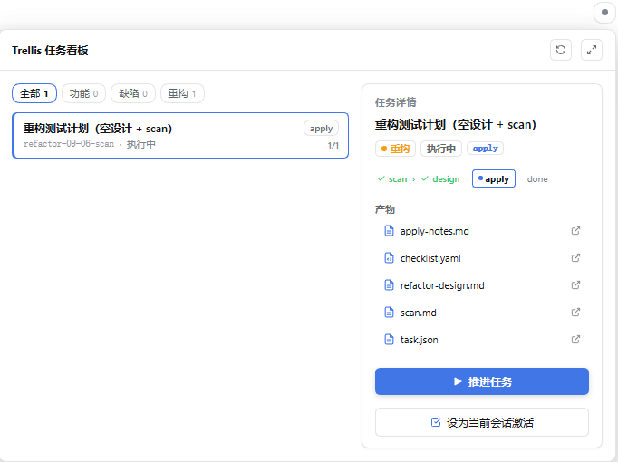
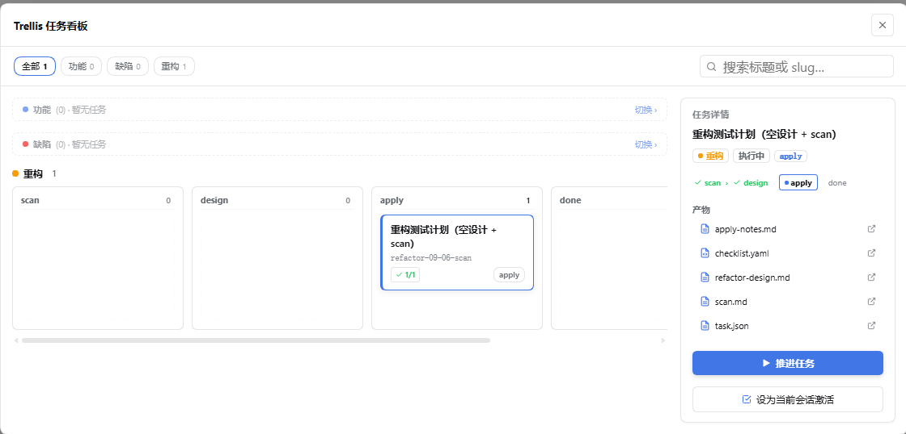
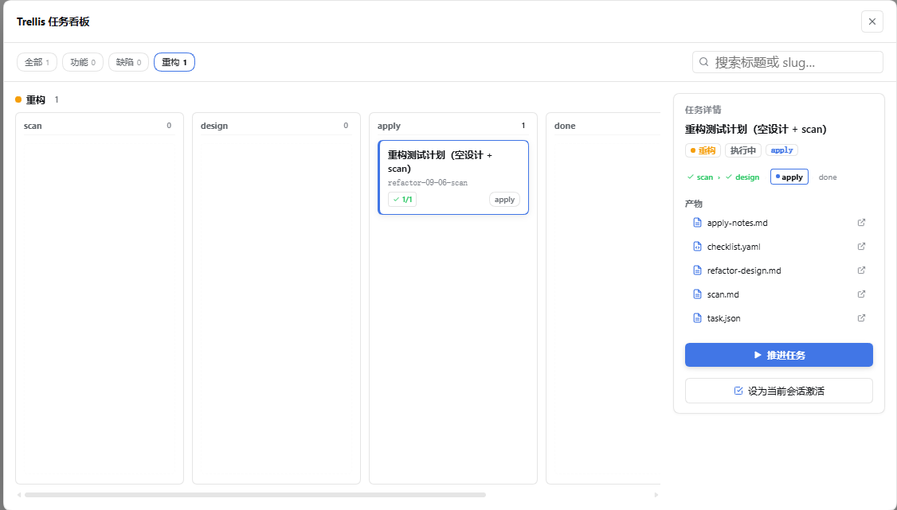

# dsh-trellis

<div align="center">
  <b style="font-size: 1.3em;">Trellis 工作流扩展 · DeepSeek Harness</b><br />
  <sub>结构化阶段流转 · 步骤状态机 · 质量验收门禁 · 可选规划期只读保护</sub><br /><br />
  <a href="https://opensource.org/licenses/MIT"></a>
  
  
  
</div>

<div align="center">
  🌏 <a href="./README.md"><b>中文</b></a> · <a href="./README_EN.md">English</a>
</div>

<br />

<p align="center">
  
  
</p>
<p align="center">
  
</p>

---

## 项目简介

`dsh-trellis` 是为 [DeepSeek Harness (DSH)](https://github.com/deepseek-ai/deepseek-harness) 开发的工程化工作流插件，借鉴了 [Trellis](https://github.com/mindfold-ai/trellis) 的阶段规范与状态机设计思想。

在大模型长程编程任务中，常见以下协作问题：
1. **未理清方案便直接修改代码**：容易引入方向性错误或破坏现有架构；
2. **任务待办散落各处**：需求文档、草稿文件与上下文记录多处待办，状态脱节；
3. **缺乏验收约束**：代码编写完成后直接标记完成，缺少自测验证或人工审核卡点。

`dsh-trellis` 通过统一的步骤状态机、任务阶段流转和运行时工具过滤，帮助大模型在复杂任务中遵循“先方案后编码、验证后再完结”的工程规范。

---

## 核心特性

- **结构化阶段流转**：提供特性开发（feat）、缺陷修复（issue）与代码重构（refactor）三条标准阶段轨道，引导模型逐步推进。
- **统一执行清单**：以任务根目录下的 `task.json.steps` 作为唯一的执行状态依据，避免分散维护清单带来的状态不一致。
- **质量验收门禁**：细化步骤流转状态（`pending`、`in_progress`、`verifying`、`blocked`、`completed`），支持区分自动化测试（AI 验证）与人工审批卡点，并在任务完结时严格检查验收状态。
- **可选规划期只读保护**：开启配置项后，可在方案获批前于运行时过滤掉代码写工具（`write` / `edit`），仅开放文档受控修改通道，确保方案敲定后再动代码。
- **会话级状态隔离**：各会话的任务绑定关系独立存储在 `.trellis/.runtime/sessions/` 中，多会话与并发子代理并行工作时互不串扰。
- **双模态任务看板**：常态为高密度紧凑任务列表（类型徽章 + 标题 + 阶段 + 步骤简标），可一键展开为全屏泳道看板（按工作流阶段细分泳道、空泳道自动折叠、实时搜索与类型筛选、归档泳道）；操作全面图标化（自包含内联 SVG 图标体系），右侧详情面板内置 **Step Tracker 步骤流水线**、产物文件树与胶囊属性标签。看板保持**克制交互**——不直接改任务状态，只提供「▶ 推进任务」将指令注入输入框由 Agent 执行，产物点击生成 `@.trellis/tasks/...` 原生文件引用交给 DSH 原生查看。
- **Git 干净度校验**：任务完成和归档时自动检查 Git 工作区状态，防止遗留未提交的脏代码。

---

## 快速上手

### 1. 安装插件

确保环境 Node.js ≥ 20，在终端运行：

```sh
dsh plugin --profile web add @banana-peeljj12/dsh-trellis@latest
```

安装完成后**重启 DSH 服务**。

### 2. 配置白名单目录（重要）

为避免非预期介入，插件默认不会拦截未授权的目录。请在 Web 端或配置文件中添加生效路径：

1. 打开 DSH Web 客户端，进入左下角 **设置 → 插件 → Trellis 工作流**；
2. 在 **白名单项目 (allowlist)** 中添加需要启用该工作流的项目根目录绝对路径，保存后即时生效。

> **提示**：若希望在方案定稿前限制模型修改源码，可在该设置页同时开启 **规划期只读保护 (enforceReadonlyPlanning)** 开关。

### 3. 开始使用

在对话中提出较复杂的需求时，模型会引导创建或推进工作流任务：

- **新增功能**：创建 `feat-mm-dd-name`，推进 `prd` → `design` → `design-review` → `impl` → `review` → `check`；
- **修复问题**：创建 `issue-mm-dd-name`，推进 `report` → `analyze` → `fix` → `fix-note`；
- **重构优化**：创建 `refactor-mm-dd-name`，推进 `scan` → `design` → `apply` → `done`。

如需在某轮对话中临时跳过工作流拦截，在消息中包含 `no-trellis` 即可。

---

## 工作流与轨道规范

插件内置了三类标准工作流轨道，任务状态与当前所处阶段（`work.stage`）紧密挂钩：

| 工作流类型 | 命名规范 | 阶段推进顺序 | 说明 |
|---|---|---|---|
| **功能特性 (`feat`)** | `feat-MM-DD-name` | `prd` → `design` → `design-review` → `impl` → `review` → `check` | 适合从 0 到 1 开发新特性或重大功能调整 |
| **缺陷修复 (`issue`)** | `issue-MM-DD-name` | `report` → `analyze` → `fix` → `fix-note` | 适合排查和定位 bug、回归问题及异常情况 |
| **代码重构 (`refactor`)** | `refactor-MM-DD-name` | `scan` → `design` → `apply` → `done` | 保持对外行为不变的前提下进行架构或代码优化 |

---

## 核心机制详解

### 1. 步骤状态机与验收门禁

任务的 `steps` 数组为执行清单，支持 5 种状态：

- `pending`：步骤待开始；
- `in_progress`：当前正在实施该步骤；
- `verifying`：代码实施完毕，等待验证；
- `blocked`：遇到外部阻塞，必须附带 `blockedReason`；
- `completed`：验证通过后完结。

#### 验证模式说明：
- **自动化验证 (`verification: 'ai'`)**：模型编写代码后，必须先运行测试并调用 `trellis_task_update` 填入 `verified: true` 与 `verificationNotes` 测试记录，随后才允许将状态更新为 `completed`，防止单次调用跳过测试。
- **人工验收卡点 (`verification: 'human'`)**：用于涉及核心契约或高风险操作的步骤。只有在用户明确同意且记录 `verifiedBy: 'human'` 后，该步骤才被允许标记为 `completed`。
- **任务完结审计**：当任务标记为完成或发起归档时，系统会校验所有步骤是否均已完成并通过验证，同时校验 Git 工作区是否干净。

### 2. 规划期只读保护（可选增强）

当在配置中启用 `enforceReadonlyPlanning: true` 时，插件会根据当前任务状态动态过滤工具列表：

| 授权状态 | 触发条件 | 可用工具 | 说明 |
|---|---|---|---|
| `undecided` | 项目在白名单内、无活跃任务且未声明跳过 | 只读分析工具 + `trellis_task_create` + `trellis_task_skip` | 引导创建任务或明确跳过工作流，避免盲目直接改写源码 |
| `planning` | 任务处于规划类阶段（`prd`, `design`, `scan`, `report` 等） | 只读分析工具 + `trellis_task_update` + `trellis_artifact_update` | 移除通用 `write` / `edit` 工具，仅放行受控的任务产物更新 |
| `authorized` | 任务进入实施阶段（`impl`, `fix`, `apply`）或用户已跳过 | 全量通用工具 | 允许根据设计方案修改项目源码 |

> 注：`trellis_artifact_update` 仅允许写入当前任务目录（`.trellis/tasks/<slug>/`）内的白名单文档，杜绝跨目录修改。

---

## 扩展工具 (Tools) 说明

插件向运行时注册了以下专用工具：

- **`trellis_task_create`**：创建新的工作流任务，生成初始 `task.json` 与阶段交付物模板，并自动绑定当前会话。
- **`trellis_task_update`**：推进任务阶段、更新步骤进度、记录验证证据或更新任务信息。
- **`trellis_artifact_update`**：安全更新任务交付文档（如 `prd.md`, `design.md`, `check.md` 等），受白名单和路径校验约束。
- **`trellis_task_archive`**：将已完成的任务归档至 `.trellis/tasks/archive/YYYY-MM/` 目录下，并解除当前会话绑定。
- **`trellis_task_skip`**：经用户同意后，在当前会话跳过 Trellis 工作流约束，直接放行全量工具权限。
- **`trellis_state`**：诊断并返回当前项目的 Trellis 运行时状态与任务信息。
- **`trellis_ui_update`**：主动刷新 Web 界面顶部的阶段徽章状态。

---

## 配置项参考

可在 Web 设置面板（**设置 → 插件 → Trellis 工作流**）或 `~/.dsh/settings.yaml` 中进行配置：

| 配置项 | 类型 | 默认值 | 说明 |
|---|---|---|---|
| `allowlist` | `string[]` | `[]` | **生效白名单**：允许插件接入的项目根目录绝对路径列表。为空时不介入任何项目 |
| `enforceReadonlyPlanning` | `boolean` | `false` | **规划期只读保护**：开启后，方案定稿前在运行时移除代码修改工具 |
| `skipKeywords` | `string[]` | `['no-trellis']` | **跳过关键词**：用户消息包含这些词时，该轮跳过工作流注入与拦截 |
| `injectStep` | `number` | `1` | 面包屑提示词的注入步数，默认仅在每轮交互第 1 步注入 |
| `inline` | `boolean` | `false` | 是否开启 codex-inline 风格的阶段解析模式 |

---

## 项目结构

```text
dsh-trellis/
├── lib/
│   ├── index.js            # 插件入口：注册 pre-step 钩子、运行时工具过滤与 API 路由
│   ├── task.js             # 任务执行逻辑：步骤流转、验证门禁检查与状态校验
│   ├── skills.js           # 技能供给：向项目注入 standard 工作流技能与产物模板
│   ├── breadcrumb.js       # 上下文提示：提取焦点步骤与构建面包屑
│   ├── readonly.js         # 只读策略：推导 undecided / planning / authorized 授权状态
│   ├── state.js            # 状态解析：阶段推断、会话指针与 slug 格式校验
│   ├── artifact.js         # 产物写入：受控文档更新与路径安全限制
│   ├── archive.js          # 归档处理：任务完结检查、目录归档迁移与 Git 干净度校验
│   ├── board.js            # 看板数据：任务记录（含 steps 聚合）、阶段泳道轨道与归档列表
│   ├── client.js           # 前端界面：Web 阶段徽章、双模态看板（紧凑列表 + 阶段泳道）与设置项
│   └── types/index.d.ts    # TypeScript 类型定义
├── skills/                 # 内置的工作流技能与各阶段 Markdown 模板
├── docs/images/            # 界面截图与架构图素材
└── test/                   # 自动化单元测试套件
```

---

## 开源协议与致谢

- 本项目基于 [MIT 许可证](./LICENSE) 开源；
- 致谢 [Trellis](https://github.com/mindfold-ai/trellis)（Mindfold）：阶段规范与面包屑设计的灵感来源；
- 致谢 [CodeStable](https://github.com/codestable/CodeStable)：优秀的三大工作流路由划分思路；
- 致谢 [DeepSeek Harness](https://github.com/deepseek-ai/deepseek-harness)：灵活可靠的 Agent 运行时环境。
