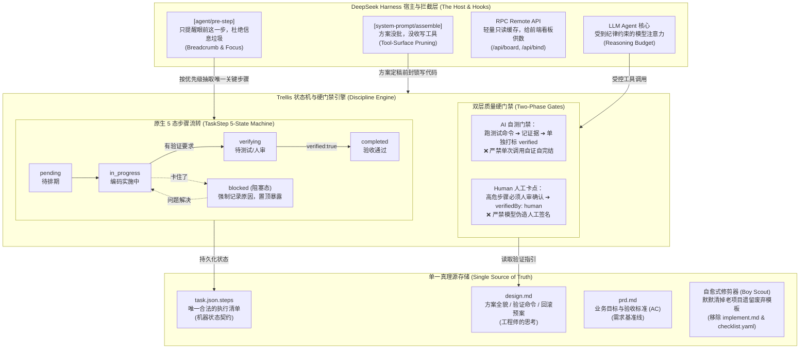

# dsh-trellis

<div align="center">
  <b style="font-size: 1.4em;">让 AI 编程学会真正的职业素养</b><br />
  <sub>先规划后动手 · 只有一个真理源 · 5 态状态机 · 严禁自证自签 · 拒绝假装测试</sub><br /><br />
  <a href="https://opensource.org/licenses/MIT"></a>
  
  
  
  
  <br /><br />
  <b>“任何傻瓜都能写出计算机能理解的代码。唯有优秀的程序员才能写出人类能理解的代码。” —— Martin Fowler</b><br />
  <i>但如果写代码的是 AI，它不仅可能写出谁也看不懂的代码，还可能把你昨天的劳动成果直接删光。</i>
</div>

<div align="center">
  🌏 <a href="./README.md"><b>中文</b></a> · <a href="./README_EN.md">English</a>
</div>

<br />

<p align="center">
  
  
</p>

---

## ☕ 坐下来，我们来聊聊现实（The Cold, Hard Reality）

星期五下午四点半。你端着刚泡好的咖啡，坐在屏幕前，给你的 AI 助手发了一条消息：

> *“帮我在用户系统里加一个简单的微信扫码登录功能。”*

你满心以为它会像个成熟的同事一样：先看看现有的认证模块是怎么写的，搞清楚边界，做个简单设计，然后再谨慎地下手。

十分钟后，你看着终端彻底傻了眼：
- 它一口气修改了 **37 个文件**；
- 它顺便“自作聪明”地把你昨天写好的数据库连接池也给重构了，美其名曰“提升现代性”；
- 它骄傲地对你说：“我已经全部搞定，并编写了完备的测试！”
- 你深吸一口气，敲下 `npm test` —— **红成一片，满屏报错**。

这根本不是敏捷开发。**这完全是一场灾难。**

### 为什么大模型会这样？

因为大模型骨子里**缺乏职业纪律（Professional Discipline）**。它就像一个绝顶聪明、满腔热情、但毫无工程敬畏心的初级实习生。

你对它说：“先别动手，先想清楚方案！”它满口答应：“好的，主人！”——然后下一秒，它就掏出文件编辑工具，对着你的核心业务代码一顿乱砍。

**不能指望自觉，必须建立规矩。**

`dsh-trellis` 做的事情非常纯粹：**给大模型戴上工程纪律的“紧箍咒”。** 它把成熟的 [Trellis](https://github.com/mindfold-ai/trellis) 结构化软件工程思想，原生融进了 [DeepSeek Harness (DSH)](https://github.com/deepseek-ai/deepseek-harness)。

---

## 📐 系统的工程架构（Architecture Overview）

我们讨厌黑话。我们相信好的架构必须像干净的代码一样——**一目了然、职责单一、边界分明**。

下面是 `dsh-trellis` 的整体运转架构：



> 🎨 **想要更细腻地缩放、平移或二次编辑架构图？**
> - 📄 **本地源文件**：[`docs/images/architecture.drawio`](./docs/images/architecture.drawio)（标准 Draw.io 格式）
> - 🌐 **在线只读全景查看**：[点击在 diagrams.net 打开](https://viewer.diagrams.net/?tags=%7B%7D&lightbox=1&edit=_blank#R5V1bc5tIFv4t%2B0Ct%2FWCXuAoeQUKTqcpMZuPszs6TCqG2zFgCFUKxvb9%2B%2B5zTDQ20LnYUW06clI0aaBr4ztfn2jLskWFPHldLwxp8ZeUmK3LDHhuWZV4P%2BG%2FeyvK0mGf5gpr%2F%2FWVy5cMOe2LYsTEIDXu0erzNlowfeldsKjpsXiYPWUEdtLq1vOsB9UxnWwP4b4%2FmWbIokxX%2FkCcrRsd%2BKdlymW2uwjK9yyqWVtuSUZfZnI6oxBEJP%2BLK7PYq%2B149%2FlIm67vfijmD25w%2Fijt0LHGL8ydq8X3RsCjlFcym4Sb7nxiYKQ%2FbZnO2aR1YFcWyytbtxrTIcz78VltSlsVD%2B7DbYtm%2B6jpZsF7DTZos%2B61%2FZvPqTrRag0Gz4wPLFnfi0oHcMUvS%2B0VZbHNxPcOyb%2FFH%2FwjlgyyLotq5u3naI%2F5SlJckrmlYk%2BefW99hyfJqR3d7e%2FzH1RVujJ%2F93xp8DP%2BKP%2FO%2FpmHDJcaMrW8Yu%2BebH5IyZ5sNbAHk4WIe%2F%2F1rXrEyZeuqKDcvviof8LMf0zJ5YuUUxY9ELlluBUa0ozZi1whjI5oYsWNEvhFFRuzDx2AAG6Fp%2BCMj9oxgaEQe3V6yWht2hOcGRmAZYYCdjPEUz%2FAjI%2FRwg58ewq6IdwJjuRCP6PM2r7IV6%2FT2oSjuN5c06k31JJG9echWyyTnn6JNlZSVkD3L5w2IWwZ3zl9MxEVf7PT4J05Ey1GxLErsxr4d3Doc1NBJWdwzZY%2BX%2BmwGe26LvLoRFzblZ%2BrQdMRn5TyT2XM34O1psVwm6002wzMHeDeC7Sr2uBO95j4J69EWK1asKp%2F4Z9GjI9D%2F1P74oEi%2FKSXkTpH8mrISQTmLuutjZZMfI3B3hNj1EHrH3%2FM02WzYCh5YF6SGG22eNhVbXa3LYrXmcJnUx7pjFC77MYFnHA8NP0DwDQF5vodQGxqhCxs%2BbgNAx0ZoIZRtwzdxV4C47GG36fviM0vmV0W%2BhOf9hfM4%2F%2FNHuc1Z2cdnG4MPMD3drJMU9j7wuYa33VV8ThWQ6oDST1ma6kA5813HHXRAaO0AqXLeMDFT0z8Wgm2yeDkW7TYW3T4WLR0Uh%2BeAxHXJONzWOiDyOTMHAPJDrvCYDgA94EaOJiDMMbAobwlHwJkN7lw8xhU0GJhwTGQboS9ACmjdh8So5FBMy%2B1q1qHLGxw0n2j%2B5vpEcWJgzhPm36aH2fJ4YJoz23Pnrw%2FMw8h0zhCZ5Tqd8vdXcZWyi8vPf4xgCmWrooIZNPzjV5yJ%2BQzNcTZGVIUAwQ5ThjB9A2IHyIIeQDHwkRc9aKG7gp6G2BPCm2MYFAO%2BwdFLkzvivDmY6wwjIwixnwkcz0%2FnKkRgCr2C71LADGS%2BzvjvWZGUc8MaUU%2BiLcvnp0UxM%2BcuG%2BpQHHhDO%2FGej2J7ZjLXeW0Uu8H7RPFyuZoKDu2SK6DDMcKhAA6nPdjwAZ5Aoqh48mOCGJDIUU690M4B6KnApxPDt1V4ffz4G4pGsilyMFPbhBk%2FsnRbcfPzsiUbXF4moN0CcEOhuXIcBxOUhNDwHYWyPfjIjycpCyKhNPuxTvfwQWb4CKEfB04%2Fqepwe2vpVYe5N%2FPcF2DbTe35YPDa2K4N7T3YNs8Q29zaT7nuwHVCDbg5gjhkAkSrCXZQTYYcCyGaV6SHAmFPJIXq9FnewrEDGkIAAsOfS5kB70%2FYPKvEucJAGwNvC%2FodI1TJiKsvNATARjQ8B4fnwMEhIjTEeaEtGP0hw7hiZcjUU6xYiqTU%2BDBkfyhFxYPh9yWkKw8cb1UH9AqENZD18AdMv2W2ALdSysDu5g2A3ixNlqHYURXrHSL2loqyaR%2BpKbvngPYMVU0tl3N4cRUB4D7GN%2BwDmASmHSRVAZnZskjvOeUhNS8qYuYs55JULErhkWh28LeS3T4hlbcZ2xMqNajLvqTuIe6K0YVB6FOli8A70ilDKF0kIaIfcoWEyq0prhAhVwHi2lKEMIDBRPRAfJwCyPcx%2BSmRfgTUnXOFOte%2FNThHM69B10QoD6FUf6Nd4OQItJWWGjAKNYcR9NCYlAFq4dKh5gdSUfFaohAgpXuwwY3NYCz0qsATc5A%2FFCSPvjtuKUw%2BCZ9fRL3j9CKn4J8KoF2l%2Bn0BdLdaXfNV7ZLYqbv2WdoB0hPa7FiAVkC05nb0noEu0vKEBKhCkB7iWwisCVw5tiXLkqY8Fu5lUpCFi9humJj%2FjlyhfPioRgSof4CIkKH60yG1qyJrkWq%2BFlK%2Fe4zFohiLCPnxrVEBwb5BnC%2BynL1BMIWJC3eErRkggtNEaauVZlQuQq1ZieRL6hKXMD%2FWGbWDizHjoFxlebbhmOQNfxbl%2Fe2yeOhYtb8kFZm69Hi%2BX%2FzE5Ranq7M3fWtme94L4iczxzbZucRPrODoAIr%2FuhMAyZR7dVMl6PH7LUnvSBButrOrqHh8IbhnxeN0A32uZIe62SSWnhAHNvg4hBem9iN2ZgW9r3EEQsBB%2FSXZ3AvHde%2BGjoeu04Nu3zlyqw%2F2HQVW6%2FRg7TLJyUxIx%2B3B1jW1YT%2F3bdWWTTVdsxzTR7pAq9tbRl4Uy7gJqaou0KkfndaL5sI%2FbZxDagk6bWKfhxh%2FjoWFTgZfDg3rYEg40CDDeXtgZDnY%2Fz1ctPwCPc9ULP1sY2ljeY0ji7TNcPyWUTHz1FGx06LFdA%2FDxT1LuChuoQ5idjmMBJfgJAWGN5rrwvXji9kKsmDct%2FTRm6f20Z%2BYXXz3neIlLVbrJVen5z28KHvaeBmiHy%2BAiYeim6CXk0MvQLyQgVo73O3TEo3L%2FLlzWH95BtEwx7PeCDiOeZBo%2FPMETu2t7sCm8WJfSAqhackU0xJqvt04I0CISMjE4z1wI5OTOcIwvDUQHVMIsxPCF%2F4cOp3sSa5oO8JVGFmtaBDo7RTpmQiHPFeeINIjI0lNMAe9KqEMyfrjt8xwMk%2Bd4fR9p0ytJ8bW6FjeW5iM8XwB%2BSODLMf3ScZW%2FRxeZDOy6XpaFdOshxHGryVfWlFWd8WiyJNl3LR2DLbmmI8FeNmw8W9WVU8CCsm2KtrI2q100R6Z92zV2IBBPQsZ%2FJaKbZkyvcXCTdAFqzRK6wsAVbJlUmVf28N7K6Zj0wze6ld9JFvGI7qqk8wcAg8zJfieASZqxaqPCZVnBnvcwqfCjmrUdKDTUmDfP3q%2BAnpSvTKewesNq3LLzgIftf70bHzUHqBT4aNjxXQg0tJZfxCCmWkIpqc9nQNKat2kjRLzMErqM1%2BBRRTt9P0DZKboFZ0Z6IB6ekaqxxEAqc9kj1n1X3AhX1vi01%2FCocwBUj4pu%2BDjX6L3U8GqZdn8KIoNqb3jbQLQ%2Bg%2FOPmkCGZ8UJ0Nl%2BNtjJotEl5Yt8jMoq4P0IfAaOO1cuL4WRZHDkS7QPbgQt%2FIv%2FiernuRdvEqgpO2hOj5QUnuo3jxQ4g4PR0qsc4yUAMCmSZ8LQ8r09wFMVFgHmf6%2BqDEB73e9ywNXph%2FpUfVVlQyMtf8zyf7Z9laQ%2B9zROEibBDhMFsGk1IsvD8XVH3fJhmG4frXKqssm9a7p17wWdxANZSkMDZOqBzDaw9vBo0%2BpqU47WUrmkVLdjMgPFHfye0ECrshWXa5QD8C6FulPIksGA0rhSJOrrcnnli4YeV3UbIE%2BQbkVdxspyb%2BUHDbBql%2BdmxETtvyRSCDo5v7qCimbNEuqMtKNWqSf1VBQ7LUaN9%2FRdbknorYrRiLzcJbsFjJ5NvxSXCv%2BiJ9oDj3a1VNz88mCaHafNRxfl49%2BDqRxt10leY83PlCrlFjhcRw2YXuRQO6gnNcTEsItxCmKT2Yc0HrqwGt22EOXFdBk1oZNZm1oKlmzeAzkme8kjj1VdQFkUEJyJbFSLFMpaRqmdPOB4UbGZAA%2BUX4KMpeSaFnLkCezd%2BusHh9%2B8%2BPdscJHRJFuQ639whXYNWwLH7pmQ18WWUc6cuoST61Q1JekhKGR2KCnSC%2ByIafoqZUrVb%2Bqb%2BKg%2Fi1iBRjV00LGkxZlQ8BDFEun87hduDASPAWp20O8ViD5c4jDUB8wvX%2B8bX8o3kw0aHPsq4TwdvqvD9PZN3u0T09zpvWWPPfdcwptIqubqihhIQ25SsMNfzG4XMkNWUfWoLjF1MMtfwavn2i4kcPbndZLSbSySlOkZklh5TJHBT8iz9wF0hBcE6NIDaETEvfWOg4qPTmYd%2BsAPVFGo6iXl2lcoroBnt%2FFoQeo1iuz5e3VB8alI198vyzFFP4dzuc5Pkuxzuc5iyxFzzw6S9F%2B4zT1NCnn0yrZ3P%2BNocwOpGHHNey5hsL6TatIGGYJB6shFLSTpgogjLEks7Z5FFhCZNPXZSCiuRCYdTLuZXcOxBqIs91oDxZmWUuXiQm2lCkz%2F0HGL8ANtN1c7uhAp%2F3Vcy4KeYBKX5LCQjZJnrIjeqrNjXo1GUeUEkBPGRw8hLGhLrK7v54NB3qaDTTW0ULR7HvTsnFdzHq%2FDmA9zxmiTAvfM21UW%2BxingWNzNmGP89VPxGDdlyv5l0CCScS11QERWrmSJgQkKSxh1JUvdUXSyFAIhDWroC42T8EgYhbF7kk9Ax6mkJT4N5bBaKmnF3dd2lX1rChjQWFa067%2BzH6MtC%2BIBODCt6oTsgfP4N8yGAzJY1ZlKkjHTJkYojFB2TZctfvhKV1vne55%2B5EpTOZZzQOquegJJtAXN6XD1g4zeR6Abx%2FyhYCIIaiho%2BWG6Cq8TPLXT1HUnvPrLYu5xpK4609PkPQBGGzuItaHip8Ay4W3IWKG6WGmo%2BeEFtgLnJ%2BEPbqPxUf7lLwfqBokLHOu0N1sVQ0js4U%2FXV%2BzaFqdltJ2%2BYmLdZMGk2tx7pvoJEsDg6FS60uWAdf7EQk6FHhZFcnq50dUjnjZBaOLvex%2BvGrT%2FQrmNHyEytIhJIKHalH05I%2B55Xren7EdETs6ayJaZvrsut1fgIqz6GqxrApb%2FRtxVdYLyTVcyooLKf6B8Rye%2BQp%2BBGoypUrB9BTcoVmEA7UpV0ycGCuOBzb%2FP%2BCntI7lt4vs011%2FZTAer47iQLUpYlSLE50FCjKjc4pDJTqKi2%2BUg3YfuO7rxx5sryb0pHrXmtXlxJPF4E%2FdaGNSJqrWHoujMzg3HKXDzPTCdZvPAlj%2Bc5hxnLPkbHE3U9nRVUVq2mOy%2BLpHKguLkdQL4cgo1qNjo5hhihCv2Yxumwvc3SEjwkQSOk0wrfVCl4fMinVHhqzthNuamk7uJ5TGLcUBNmD1CIH2AMuDWUNlNWh1MUYhooVY%2B2VO93pYkKgxaXwyQQY1xIt8TMXbNCllOCPbsEGVdzOwKli6mrIB57OO%2Fuuoiijz59ubq5kLGX06fff49GXT59vXjVEAjlv07RaftOia72A5hlnm1qHlzKpz2ySCV0lmdDsJBO6ajbhkUmqZj99ULOAs5pBeKKSm%2FPKT5Xg27kGmrrc3kQEJiJHLqc%2BlApxJy2itxbwmdfVHMBjXc58FB6Hp8RjaxnnnwaOu5eBOrgYqSYTRV3VV5ukI7PbwvF7KvbZV0f9qkDtrIfbRem3ZHWcHzw3T3k6FcFdHVuOZJQwkGafDL50g7890%2FAdFRKZewqJ9BUAHeydCHr6ogAVgb14%2FY%2BDwl0Z%2B%2F24UT8MhJ4MSrmj9JqfaYY%2BIfiUd9BDnRrefSeow8N2fAmS6EL5pqn2F1zxvfI7ruT3ZuEJ%2BNVZdvx%2F)
> - ✏️ **在线直接编辑副本**：[点击在 diagrams.net 编辑](https://app.diagrams.net/?grid=0&pv=0&border=10&edit=_blank#create=%7B%22type%22%3A%20%22xml%22%2C%20%22compressed%22%3A%20true%2C%20%22data%22%3A%20%225V1bc5tIFv4t%2B0Ct%2FWCXuAoeQUKTqcpMZuPszs6TCqG2zFgCFUKxvb9%2B%2B5zTDQ20LnYUW06clI0aaBr4ztfn2jLskWFPHldLwxp8ZeUmK3LDHhuWZV4P%2BG%2FeyvK0mGf5gpr%2F%2FWVy5cMOe2LYsTEIDXu0erzNlowfeldsKjpsXiYPWUEdtLq1vOsB9UxnWwP4b4%2FmWbIokxX%2FkCcrRsd%2BKdlymW2uwjK9yyqWVtuSUZfZnI6oxBEJP%2BLK7PYq%2B149%2FlIm67vfijmD25w%2Fijt0LHGL8ydq8X3RsCjlFcym4Sb7nxiYKQ%2FbZnO2aR1YFcWyytbtxrTIcz78VltSlsVD%2B7DbYtm%2B6jpZsF7DTZos%2B61%2FZvPqTrRag0Gz4wPLFnfi0oHcMUvS%2B0VZbHNxPcOyb%2FFH%2FwjlgyyLotq5u3naI%2F5SlJckrmlYk%2BefW99hyfJqR3d7e%2FzH1RVujJ%2F93xp8DP%2BKP%2FO%2FpmHDJcaMrW8Yu%2BebH5IyZ5sNbAHk4WIe%2F%2F1rXrEyZeuqKDcvviof8LMf0zJ5YuUUxY9ELlluBUa0ozZi1whjI5oYsWNEvhFFRuzDx2AAG6Fp%2BCMj9oxgaEQe3V6yWht2hOcGRmAZYYCdjPEUz%2FAjI%2FRwg58ewq6IdwJjuRCP6PM2r7IV6%2FT2oSjuN5c06k31JJG9echWyyTnn6JNlZSVkD3L5w2IWwZ3zl9MxEVf7PT4J05Ey1GxLErsxr4d3Doc1NBJWdwzZY%2BX%2BmwGe26LvLoRFzblZ%2BrQdMRn5TyT2XM34O1psVwm6002wzMHeDeC7Sr2uBO95j4J69EWK1asKp%2F4Z9GjI9D%2F1P74oEi%2FKSXkTpH8mrISQTmLuutjZZMfI3B3hNj1EHrH3%2FM02WzYCh5YF6SGG22eNhVbXa3LYrXmcJnUx7pjFC77MYFnHA8NP0DwDQF5vodQGxqhCxs%2BbgNAx0ZoIZRtwzdxV4C47GG36fviM0vmV0W%2BhOf9hfM4%2F%2FNHuc1Z2cdnG4MPMD3drJMU9j7wuYa33VV8ThWQ6oDST1ma6kA5813HHXRAaO0AqXLeMDFT0z8Wgm2yeDkW7TYW3T4WLR0Uh%2BeAxHXJONzWOiDyOTMHAPJDrvCYDgA94EaOJiDMMbAobwlHwJkN7lw8xhU0GJhwTGQboS9ACmjdh8So5FBMy%2B1q1qHLGxw0n2j%2B5vpEcWJgzhPm36aH2fJ4YJoz23Pnrw%2FMw8h0zhCZ5Tqd8vdXcZWyi8vPf4xgCmWrooIZNPzjV5yJ%2BQzNcTZGVIUAwQ5ThjB9A2IHyIIeQDHwkRc9aKG7gp6G2BPCm2MYFAO%2BwdFLkzvivDmY6wwjIwixnwkcz0%2FnKkRgCr2C71LADGS%2BzvjvWZGUc8MaUU%2BiLcvnp0UxM%2BcuG%2BpQHHhDO%2FGej2J7ZjLXeW0Uu8H7RPFyuZoKDu2SK6DDMcKhAA6nPdjwAZ5Aoqh48mOCGJDIUU690M4B6KnApxPDt1V4ffz4G4pGsilyMFPbhBk%2FsnRbcfPzsiUbXF4moN0CcEOhuXIcBxOUhNDwHYWyPfjIjycpCyKhNPuxTvfwQWb4CKEfB04%2Fqepwe2vpVYe5N%2FPcF2DbTe35YPDa2K4N7T3YNs8Q29zaT7nuwHVCDbg5gjhkAkSrCXZQTYYcCyGaV6SHAmFPJIXq9FnewrEDGkIAAsOfS5kB70%2FYPKvEucJAGwNvC%2FodI1TJiKsvNATARjQ8B4fnwMEhIjTEeaEtGP0hw7hiZcjUU6xYiqTU%2BDBkfyhFxYPh9yWkKw8cb1UH9AqENZD18AdMv2W2ALdSysDu5g2A3ixNlqHYURXrHSL2loqyaR%2BpKbvngPYMVU0tl3N4cRUB4D7GN%2BwDmASmHSRVAZnZskjvOeUhNS8qYuYs55JULErhkWh28LeS3T4hlbcZ2xMqNajLvqTuIe6K0YVB6FOli8A70ilDKF0kIaIfcoWEyq0prhAhVwHi2lKEMIDBRPRAfJwCyPcx%2BSmRfgTUnXOFOte%2FNThHM69B10QoD6FUf6Nd4OQItJWWGjAKNYcR9NCYlAFq4dKh5gdSUfFaohAgpXuwwY3NYCz0qsATc5A%2FFCSPvjtuKUw%2BCZ9fRL3j9CKn4J8KoF2l%2Bn0BdLdaXfNV7ZLYqbv2WdoB0hPa7FiAVkC05nb0noEu0vKEBKhCkB7iWwisCVw5tiXLkqY8Fu5lUpCFi9humJj%2FjlyhfPioRgSof4CIkKH60yG1qyJrkWq%2BFlK%2Fe4zFohiLCPnxrVEBwb5BnC%2BynL1BMIWJC3eErRkggtNEaauVZlQuQq1ZieRL6hKXMD%2FWGbWDizHjoFxlebbhmOQNfxbl%2Fe2yeOhYtb8kFZm69Hi%2BX%2FzE5Ranq7M3fWtme94L4iczxzbZucRPrODoAIr%2FuhMAyZR7dVMl6PH7LUnvSBButrOrqHh8IbhnxeN0A32uZIe62SSWnhAHNvg4hBem9iN2ZgW9r3EEQsBB%2FSXZ3AvHde%2BGjoeu04Nu3zlyqw%2F2HQVW6%2FRg7TLJyUxIx%2B3B1jW1YT%2F3bdWWTTVdsxzTR7pAq9tbRl4Uy7gJqaou0KkfndaL5sI%2FbZxDagk6bWKfhxh%2FjoWFTgZfDg3rYEg40CDDeXtgZDnY%2Fz1ctPwCPc9ULP1sY2ljeY0ji7TNcPyWUTHz1FGx06LFdA%2FDxT1LuChuoQ5idjmMBJfgJAWGN5rrwvXji9kKsmDct%2FTRm6f20Z%2BYXXz3neIlLVbrJVen5z28KHvaeBmiHy%2BAiYeim6CXk0MvQLyQgVo73O3TEo3L%2FLlzWH95BtEwx7PeCDiOeZBo%2FPMETu2t7sCm8WJfSAqhackU0xJqvt04I0CISMjE4z1wI5OTOcIwvDUQHVMIsxPCF%2F4cOp3sSa5oO8JVGFmtaBDo7RTpmQiHPFeeINIjI0lNMAe9KqEMyfrjt8xwMk%2Bd4fR9p0ytJ8bW6FjeW5iM8XwB%2BSODLMf3ScZW%2FRxeZDOy6XpaFdOshxHGryVfWlFWd8WiyJNl3LR2DLbmmI8FeNmw8W9WVU8CCsm2KtrI2q100R6Z92zV2IBBPQsZ%2FJaKbZkyvcXCTdAFqzRK6wsAVbJlUmVf28N7K6Zj0wze6ld9JFvGI7qqk8wcAg8zJfieASZqxaqPCZVnBnvcwqfCjmrUdKDTUmDfP3q%2BAnpSvTKewesNq3LLzgIftf70bHzUHqBT4aNjxXQg0tJZfxCCmWkIpqc9nQNKat2kjRLzMErqM1%2BBRRTt9P0DZKboFZ0Z6IB6ekaqxxEAqc9kj1n1X3AhX1vi01%2FCocwBUj4pu%2BDjX6L3U8GqZdn8KIoNqb3jbQLQ%2Bg%2FOPmkCGZ8UJ0Nl%2BNtjJotEl5Yt8jMoq4P0IfAaOO1cuL4WRZHDkS7QPbgQt%2FIv%2FiernuRdvEqgpO2hOj5QUnuo3jxQ4g4PR0qsc4yUAMCmSZ8LQ8r09wFMVFgHmf6%2BqDEB73e9ywNXph%2FpUfVVlQyMtf8zyf7Z9laQ%2B9zROEibBDhMFsGk1IsvD8XVH3fJhmG4frXKqssm9a7p17wWdxANZSkMDZOqBzDaw9vBo0%2BpqU47WUrmkVLdjMgPFHfye0ECrshWXa5QD8C6FulPIksGA0rhSJOrrcnnli4YeV3UbIE%2BQbkVdxspyb%2BUHDbBql%2BdmxETtvyRSCDo5v7qCimbNEuqMtKNWqSf1VBQ7LUaN9%2FRdbknorYrRiLzcJbsFjJ5NvxSXCv%2BiJ9oDj3a1VNz88mCaHafNRxfl49%2BDqRxt10leY83PlCrlFjhcRw2YXuRQO6gnNcTEsItxCmKT2Yc0HrqwGt22EOXFdBk1oZNZm1oKlmzeAzkme8kjj1VdQFkUEJyJbFSLFMpaRqmdPOB4UbGZAA%2BUX4KMpeSaFnLkCezd%2BusHh9%2B8%2BPdscJHRJFuQ639whXYNWwLH7pmQ18WWUc6cuoST61Q1JekhKGR2KCnSC%2ByIafoqZUrVb%2Bqb%2BKg%2Fi1iBRjV00LGkxZlQ8BDFEun87hduDASPAWp20O8ViD5c4jDUB8wvX%2B8bX8o3kw0aHPsq4TwdvqvD9PZN3u0T09zpvWWPPfdcwptIqubqihhIQ25SsMNfzG4XMkNWUfWoLjF1MMtfwavn2i4kcPbndZLSbSySlOkZklh5TJHBT8iz9wF0hBcE6NIDaETEvfWOg4qPTmYd%2BsAPVFGo6iXl2lcoroBnt%2FFoQeo1iuz5e3VB8alI198vyzFFP4dzuc5Pkuxzuc5iyxFzzw6S9F%2B4zT1NCnn0yrZ3P%2BNocwOpGHHNey5hsL6TatIGGYJB6shFLSTpgogjLEks7Z5FFhCZNPXZSCiuRCYdTLuZXcOxBqIs91oDxZmWUuXiQm2lCkz%2F0HGL8ANtN1c7uhAp%2F3Vcy4KeYBKX5LCQjZJnrIjeqrNjXo1GUeUEkBPGRw8hLGhLrK7v54NB3qaDTTW0ULR7HvTsnFdzHq%2FDmA9zxmiTAvfM21UW%2BxingWNzNmGP89VPxGDdlyv5l0CCScS11QERWrmSJgQkKSxh1JUvdUXSyFAIhDWroC42T8EgYhbF7kk9Ax6mkJT4N5bBaKmnF3dd2lX1rChjQWFa067%2BzH6MtC%2BIBODCt6oTsgfP4N8yGAzJY1ZlKkjHTJkYojFB2TZctfvhKV1vne55%2B5EpTOZZzQOquegJJtAXN6XD1g4zeR6Abx%2FyhYCIIaiho%2BWG6Cq8TPLXT1HUnvPrLYu5xpK4609PkPQBGGzuItaHip8Ay4W3IWKG6WGmo%2BeEFtgLnJ%2BEPbqPxUf7lLwfqBokLHOu0N1sVQ0js4U%2FXV%2BzaFqdltJ2%2BYmLdZMGk2tx7pvoJEsDg6FS60uWAdf7EQk6FHhZFcnq50dUjnjZBaOLvex%2BvGrT%2FQrmNHyEytIhJIKHalH05I%2B55Xren7EdETs6ayJaZvrsut1fgIqz6GqxrApb%2FRtxVdYLyTVcyooLKf6B8Rye%2BQp%2BBGoypUrB9BTcoVmEA7UpV0ycGCuOBzb%2FP%2BCntI7lt4vs011%2FZTAer47iQLUpYlSLE50FCjKjc4pDJTqKi2%2BUg3YfuO7rxx5sryb0pHrXmtXlxJPF4E%2FdaGNSJqrWHoujMzg3HKXDzPTCdZvPAlj%2Bc5hxnLPkbHE3U9nRVUVq2mOy%2BLpHKguLkdQL4cgo1qNjo5hhihCv2Yxumwvc3SEjwkQSOk0wrfVCl4fMinVHhqzthNuamk7uJ5TGLcUBNmD1CIH2AMuDWUNlNWh1MUYhooVY%2B2VO93pYkKgxaXwyQQY1xIt8TMXbNCllOCPbsEGVdzOwKli6mrIB57OO%2Fuuoiijz59ubq5kLGX06fff49GXT59vXjVEAjlv07RaftOia72A5hlnm1qHlzKpz2ySCV0lmdDsJBO6ajbhkUmqZj99ULOAs5pBeKKSm%2FPKT5Xg27kGmrrc3kQEJiJHLqc%2BlApxJy2itxbwmdfVHMBjXc58FB6Hp8RjaxnnnwaOu5eBOrgYqSYTRV3VV5ukI7PbwvF7KvbZV0f9qkDtrIfbRem3ZHWcHzw3T3k6FcFdHVuOZJQwkGafDL50g7890%2FAdFRKZewqJ9BUAHeydCHr6ogAVgb14%2FY%2BDwl0Z%2B%2F24UT8MhJ4MSrmj9JqfaYY%2BIfiUd9BDnRrefSeow8N2fAmS6EL5pqn2F1zxvfI7ruT3ZuEJ%2BNVZdvx%2F%22%7D)

---

## 🛠️ 我们如何消灭这些灾难？（The Core Disciplines）

软件工程里有句老话：**纪律胜过激情。** 我们通过五条铁律，把原本可能发疯的模型规训成一个严谨靠谱的搭档。

### 铁律 1：方案没批，没收写工具（物理只读保护）

很多开发者喜欢在 System Prompt 里长篇大论：“请注意！在方案被用户批准前，绝对不要修改代码！”

**这根本没用。** 面对复杂的上下文，大模型的自回归本能会驱使它去“猜”实现。它嘴上答应得好好的，手头却偷偷调了 `write` 工具。

我们的做法简单粗暴：
- 当任务处于规划阶段（`prd`、`design` 等）时，插件在底层直接**把 `write` 和 `edit` 工具从大模型的视野中剔除**！
- 模型手里只剩放大镜（`read`、`grep`、`glob`）和一张受限的草稿纸（`trellis_artifact_update`）；
- 它就算想改代码，在工具列表里根本找不到扳手！它只能老老实实把精力 100% 倾注在调研仓库、梳理架构和撰写方案上。

### 铁律 2：当你有两块手表，你永远不知道时间（单一真理源）

在过去，很多工作流设计犯了一个低级错误：
- 特性开发在 `implement.md` 写了一张“待办清单”；
- 代码重构在 `checklist.yaml` 里又写了一张带私有状态的清单；
- 任务根目录 `task.json` 还有一个 steps 数组。

**这是典型的双写地狱。** AI 一会儿更新这个，一会儿划掉那个，到最后连它自己都不知道到底做完了没有。

我们进行了彻底的重构（方案 C）：
1. **清单只有一份**：全部收归 `task.json.steps`。它是机器推进的唯一契约，绝无第二套平行清单；
2. **职责彻底分离**：
   - 机器状态归 `task.json`（谁在做、什么状态、有没有验证）；
   - 工程师的思考归 `design.md`（架构图、数据流、测试命令列表、回滚预案）；
   - 业务需求归 `prd.md`（要解决什么、验收标准 AC 是什么）；
3. **童子军军规（Boy Scout Rule）**：
   旧项目升级插件后残留的历史模板怎么办？插件在启动时会自动进行**安全修剪（Self-Healing Pruning）**，默默把老项目里的孤儿模板清理干净，**绝不留技术债，更绝不触碰任何历史任务数据**。

### 铁律 3：自证自测是耍流氓，必须两阶段提交（5 态状态机）

一个步骤“做完了”，真的就代表它做完了吗？

普通模式下，AI 写完代码就自己打勾：“我写完了，很完美！”——这就是在自欺欺人。

我们引入了原生的 **5 态步骤流转机制** 与 **两阶段硬门禁**：

| 状态 | 真正的人话含义 | 门禁规则 |
|---|---|---|
| `pending` | 还没开工，在队里排着呢 | 等前置步骤完成 |
| `in_progress` | 正在埋头写代码 | 只能改当前这一步相关的逻辑，严禁跨步跳项 |
| `verifying` | **代码写完了，但绝不允许关单！** 正在跑验证 | **必须停下来测试**。AI 跑测试用例；Human 等待用户确认 |
| `blocked` | **遇到坑卡住了！** | **强制写明 blockedReason**，并在每次提问时置顶高亮暴露 |
| `completed` | 经过客观检验，确认合格 | **两阶段提交**：必须先记录验证凭证，下一轮才允许关单 |

#### 针对 AI 自测（`verification: 'ai'`）：
模型**严禁**在单次工具调用中一边说“我测过了”一边直接完成。它必须先拿出测试命令的输出作为证据（`verificationNotes`），持久化存盘，下一轮才放行完成。

#### 针对 Human 验收卡点（`verification: 'human'`）：
涉及架构重构、接口契约破坏、或者高危删除操作的步骤，标记为人工验收。
**工具层物理拦截模型的自证自签！** 如果没有人类在会话里的明确认可并记录 `verifiedBy: 'human'`，模型打死也推不进 `completed`。机器永远无法假冒人类签名。

### 铁律 4：别把整本百科全书糊在厨师脸上（高信噪比注入）

如果每次向厨师点一道“番茄炒蛋”，你都把满汉全席的 100 道菜谱全念一遍，厨师很快就会精神崩溃。

在长程对话中，很多工具会把成千上万行的全量清单每轮都发给模型。上下文迅速被无用的垃圾信息淹没，模型的逻辑能力雪崩式下滑。

我们的注意力管理原则是：**每次只谈眼前这一步。**
1. **优先级队列决断**：
   $$\mathbf{blocked (卡点最优先)} \succ \mathbf{in\_progress (当前编码)} \succ \mathbf{verifying (正在测试)} \succ \mathbf{pending}$$
   如果代码卡住了，全系统最优先提醒解决阻断；如果顺利推进，只提醒当前步骤的验收指标，多余的一概不提。
2. **内存级快照防刷屏**：
   如果同一步骤连续几轮都在干活，插件自动降级为单行轻量提醒，**0 磁盘 I/O 损耗**，省下宝贵的 Token 让模型专注于代码本身。

### 铁律 5：多开窗口绝不串味（会话级指针物理隔离）

你打开了三个终端窗口：一个在开发新功能，一个在修昨天的线上紧急 Bug，还有一个在跑性能压测。

如果插件用的是“全局当前任务”，这三个窗口会立刻互相打架，把彼此的代码和进度弄得一团糟。

我们使用严格的 **会话指针隔离（Per-Session Pointer Isolation）**：
每个会话拥有独立的 `.trellis/.runtime/sessions/<session-id>.json`，窗口 A 永远不知道窗口 B 在做什么。互不干扰，绝不串味。

---

## ⚡ 极速上手：三步进入正轨

### 第一步：安装插件

确保环境安装了 Node.js ≥ 20，终端运行：

```sh
# 一键安装
dsh plugin --profile web add @banana-peeljj12/dsh-trellis

# 以后随时更新最新版
dsh plugin --profile web add @banana-peeljj12/dsh-trellis@latest
```

安装完成后，**重启一次 DSH 服务**。

### 第二步：添加项目白名单

出于安全考虑，插件不会擅自介入未授权的文件夹。

1. 刷新 DSH 浏览器页面；
2. 点击左下角 **设置 → 插件 → Trellis 工作流**；
3. 把你的项目绝对路径（如 `D:/code/my-project` 或 `/home/user/project`）加进 **白名单项目 (allowlist)**，保存立即生效，无需重启。

### 第三步：开始正常的对话

像平时一样向你的 AI 提需求：
> *“帮我给现有的订单模块增加导出 Excel 功能。”*

AI 将会自动遵守职业操守：
1. 识别意图，征询你的同意后创建规范任务（如 `feat-09-06-export-excel`）；
2. 自动开启规划期只读保护，在 `prd.md` 和 `design.md` 中为你梳理清楚影响范围与方案；
3. 将实现步骤拆解为清晰的 `steps`（哪些由它跑单元测试验证，哪些需要你最终肉眼看一眼）；
4. 获得你的方案审批后，稳步敲代码、跑测试、呈报验收，最后把代码干干净净地归档入库！

---

## 🧭 三大经典场景路由

| 场景 | 对应技能 | 走过的标准道路 | 为什么这么设计？ |
|---|---|---|---|
| **新增功能 / 业务迭代** | `trellis-feat` | `需求 (prd)` → `设计 (design)` → `方案评审` → `编码 (impl)` → `代码审查` → `验收 (check)` | 不打无准备之仗。支持 `quick`（小修小补快速通行）与 `standard`（规范完整流） |
| **线上紧急 Bug / 偶发异常** | `trellis-issue` | `复现 (report)` → `根因分析 (analyze)` → `修复 (fix)` → `备忘 (fix-note)` | 严禁头痛医头。必须先找复现步骤和根因；遇到来回修不好的死循环，自动触发 `trellis-break-loop` 换思路 |
| **代码重构 / 架构瘦身** | `trellis-refactor` | `扫描范围 (scan)` → `方案 (design)` → `分步实施 (apply)` → `完工` | **绝不改变外部可观察行为！** 步步都有行为等价验证，杜绝借重构之名乱改功能 |

---

## ⚙️ 核心配置参数

在 Web 设置界面（**设置 → 插件 → Trellis 工作流**）或 `~/.dsh/settings.yaml` 中配置：

| 参数 | 类型 | 默认值 | 人话解释 |
|---|---|---|---|
| `allowlist` | `string[]` | `[]` | **安全白名单**：你的项目根目录绝对路径。不在名单里的项目绝对不碰 |
| `enforceReadonlyPlanning` | `boolean` | `false` | **只读保护主开关**：开启后，方案没通过前物理没收 AI 的写代码工具 |
| `skipKeywords` | `string[]` | `['no-trellis']` | **紧急逃生通道**：如果提问里包含这个词，这一轮 AI 完全自由发挥，不触发任何工作流 |
| `injectStep` | `number` | `1` | 面包屑在第几步注入，默认 1（即每次提问的第一步提醒，之后保持安静） |

---

## 📂 代码库全景骨架（Clean Package Layout）

遵循关注点分离原则：

```text
dsh-trellis/
├── lib/
│   ├── index.js            # 入口总管：挂载 DSH 钩子、装配权限拦截、暴露 RPC 路由
│   ├── task.js             # 步骤执行引擎：5 态状态机流转、AI/Human 双门禁校验、完结审计
│   ├── skills.js           # 技能供给站：自动向项目补齐权威技能，顺手清理废弃孤儿模板
│   ├── breadcrumb.js       # 提醒构建器：计算最高优先级步骤，分级渲染高信噪比提示词
│   ├── readonly.js         # 权限判定：把任务阶段翻译为授权状态（undecided / planning / authorized）
│   ├── state.js            # 状态机解析：推导任务阶段、隔离会话指针、计算月度归档路径
│   ├── artifact.js         # 交付物专道：受控产物更新工具，防越权、防路径穿越
│   ├── archive.js          # 归档机：检查工作区干净度，安全移入归档库
│   ├── board.js            # 看板供数：纯内存聚合活动任务与归档树，绝不卡死 I/O
│   ├── client.js           # Web 前端：右上角阶段徽标、弹窗 Mini 看板与设置项
│   └── types/index.d.ts    # 严谨的 TypeScript 契约声明
├── skills/                 # 15 个随包分发的资深工程师技能与标准模板
├── docs/images/            # 交互截图与 architecture.drawio 架构设计源文件
└── test/                   # 72+ 项纯原生严谨自动化测试（0 回归保障）
```

---

## 🤝 我们的致谢

- **[Trellis](https://github.com/mindfold-ai/trellis)**（Mindfold）：感谢其开创性的工程工作流思路；本项目在遵循其优秀思想的前提下，以纯正的 Node.js ESM 原生重写了全部实现，不包含任何 AGPL 源码，以自由的 MIT 协议回馈社区。
- **[CodeStable](https://github.com/codestable/CodeStable)**：感谢其三大工作流路由哲学的启发。
- **[DeepSeek Harness](https://github.com/deepseek-ai/deepseek-harness)**：卓越的 Agent 运行时底座。

---

## 📄 协议

本项目采用 [MIT 许可证](./LICENSE) 开源。真正的工匠追求可靠，更尊重自由。
