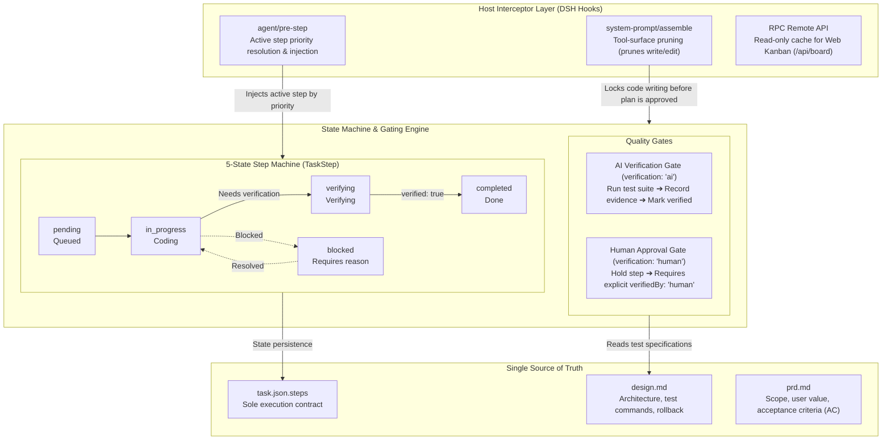

# dsh-trellis

<div align="center">
  <b style="font-size: 1.3em;">Trellis Workflow Extension for DeepSeek Harness</b><br />
  <sub>Read-only Planning · 5-State Engine · AI/Human Dual Verification Gates · Single Source of Truth</sub><br /><br />
  <a href="https://opensource.org/licenses/MIT"></a>
  
  
  
  
</div>

<div align="center">
  🌏 <a href="./README.md">中文</a> · <a href="./README_EN.md"><b>English</b></a>
</div>

<br />

<p align="center">
  
  
</p>

---

## Overview

`dsh-trellis` is an engineering workflow extension for [DeepSeek Harness (DSH)](https://github.com/deepseek-ai/deepseek-harness), re-architected on top of the structured stage model and state-machine principles of [Trellis](https://github.com/mindfold-ai/trellis).

It hooks directly into host lifecycle events to resolve three core challenges in long-running AI agent coding:
1. **Premature Implementation**: Strips generic write tools from the model during planning phases, preventing code modifications before plans are approved;
2. **Scattered Checklists**: Eliminates redundant lists across multiple markdown artifacts, establishing `task.json.steps` as the sole source of truth;
3. **Absence of Quality Gates**: Enforces a 5-state step machine with two-phase commits, differentiating automated AI testing from mandatory human approval gates.

---

## System Architecture

The system consists of a host interceptor layer, an engine/gating layer, and a structured storage layer:



- 📄 **Draw.io Source File**: [`docs/images/architecture.drawio`](./docs/images/architecture.drawio)
- 🌐 **Online Interactive Viewer**: [Open in diagrams.net](https://viewer.diagrams.net/?tags=%7B%7D&lightbox=1&edit=_blank#R5V1bc5tIFv4t%2B0Ct%2FWCXuAoeQUKTqcpMZuPszs6TCqG2zFgCFUKxvb9%2B%2B5zTDQ20LnYUW06clI0aaBr4ztfn2jLskWFPHldLwxp8ZeUmK3LDHhuWZV4P%2BG%2FeyvK0mGf5gpr%2F%2FWVy5cMOe2LYsTEIDXu0erzNlowfeldsKjpsXiYPWUEdtLq1vOsB9UxnWwP4b4%2FmWbIokxX%2FkCcrRsd%2BKdlymW2uwjK9yyqWVtuSUZfZnI6oxBEJP%2BLK7PYq%2B149%2FlIm67vfijmD25w%2Fijt0LHGL8ydq8X3RsCjlFcym4Sb7nxiYKQ%2FbZnO2aR1YFcWyytbtxrTIcz78VltSlsVD%2B7DbYtm%2B6jpZsF7DTZos%2B61%2FZvPqTrRag0Gz4wPLFnfi0oHcMUvS%2B0VZbHNxPcOyb%2FFH%2FwjlgyyLotq5u3naI%2F5SlJckrmlYk%2BefW99hyfJqR3d7e%2FzH1RVujJ%2F93xp8DP%2BKP%2FO%2FpmHDJcaMrW8Yu%2BebH5IyZ5sNbAHk4WIe%2F%2F1rXrEyZeuqKDcvviof8LMf0zJ5YuUUxY9ELlluBUa0ozZi1whjI5oYsWNEvhFFRuzDx2AAG6Fp%2BCMj9oxgaEQe3V6yWht2hOcGRmAZYYCdjPEUz%2FAjI%2FRwg58ewq6IdwJjuRCP6PM2r7IV6%2FT2oSjuN5c06k31JJG9echWyyTnn6JNlZSVkD3L5w2IWwZ3zl9MxEVf7PT4J05Ey1GxLErsxr4d3Doc1NBJWdwzZY%2BX%2BmwGe26LvLoRFzblZ%2BrQdMRn5TyT2XM34O1psVwm6002wzMHeDeC7Sr2uBO95j4J69EWK1asKp%2F4Z9GjI9D%2F1P74oEi%2FKSXkTpH8mrISQTmLuutjZZMfI3B3hNj1EHrH3%2FM02WzYCh5YF6SGG22eNhVbXa3LYrXmcJnUx7pjFC77MYFnHA8NP0DwDQF5vodQGxqhCxs%2BbgNAx0ZoIZRtwzdxV4C47GG36fviM0vmV0W%2BhOf9hfM4%2F%2FNHuc1Z2cdnG4MPMD3drJMU9j7wuYa33VV8ThWQ6oDST1ma6kA5813HHXRAaO0AqXLeMDFT0z8Wgm2yeDkW7TYW3T4WLR0Uh%2BeAxHXJONzWOiDyOTMHAPJDrvCYDgA94EaOJiDMMbAobwlHwJkN7lw8xhU0GJhwTGQboS9ACmjdh8So5FBMy%2B1q1qHLGxw0n2j%2B5vpEcWJgzhPm36aH2fJ4YJoz23Pnrw%2FMw8h0zhCZ5Tqd8vdXcZWyi8vPf4xgCmWrooIZNPzjV5yJ%2BQzNcTZGVIUAwQ5ThjB9A2IHyIIeQDHwkRc9aKG7gp6G2BPCm2MYFAO%2BwdFLkzvivDmY6wwjIwixnwkcz0%2FnKkRgCr2C71LADGS%2BzvjvWZGUc8MaUU%2BiLcvnp0UxM%2BcuG%2BpQHHhDO%2FGej2J7ZjLXeW0Uu8H7RPFyuZoKDu2SK6DDMcKhAA6nPdjwAZ5Aoqh48mOCGJDIUU690M4B6KnApxPDt1V4ffz4G4pGsilyMFPbhBk%2FsnRbcfPzsiUbXF4moN0CcEOhuXIcBxOUhNDwHYWyPfjIjycpCyKhNPuxTvfwQWb4CKEfB04%2Fqepwe2vpVYe5N%2FPcF2DbTe35YPDa2K4N7T3YNs8Q29zaT7nuwHVCDbg5gjhkAkSrCXZQTYYcCyGaV6SHAmFPJIXq9FnewrEDGkIAAsOfS5kB70%2FYPKvEucJAGwNvC%2FodI1TJiKsvNATARjQ8B4fnwMEhIjTEeaEtGP0hw7hiZcjUU6xYiqTU%2BDBkfyhFxYPh9yWkKw8cb1UH9AqENZD18AdMv2W2ALdSysDu5g2A3ixNlqHYURXrHSL2loqyaR%2BpKbvngPYMVU0tl3N4cRUB4D7GN%2BwDmASmHSRVAZnZskjvOeUhNS8qYuYs55JULErhkWh28LeS3T4hlbcZ2xMqNajLvqTuIe6K0YVB6FOli8A70ilDKF0kIaIfcoWEyq0prhAhVwHi2lKEMIDBRPRAfJwCyPcx%2BSmRfgTUnXOFOte%2FNThHM69B10QoD6FUf6Nd4OQItJWWGjAKNYcR9NCYlAFq4dKh5gdSUfFaohAgpXuwwY3NYCz0qsATc5A%2FFCSPvjtuKUw%2BCZ9fRL3j9CKn4J8KoF2l%2Bn0BdLdaXfNV7ZLYqbv2WdoB0hPa7FiAVkC05nb0noEu0vKEBKhCkB7iWwisCVw5tiXLkqY8Fu5lUpCFi9humJj%2FjlyhfPioRgSof4CIkKH60yG1qyJrkWq%2BFlK%2Fe4zFohiLCPnxrVEBwb5BnC%2BynL1BMIWJC3eErRkggtNEaauVZlQuQq1ZieRL6hKXMD%2FWGbWDizHjoFxlebbhmOQNfxbl%2Fe2yeOhYtb8kFZm69Hi%2BX%2FzE5Ranq7M3fWtme94L4iczxzbZucRPrODoAIr%2FuhMAyZR7dVMl6PH7LUnvSBButrOrqHh8IbhnxeN0A32uZIe62SSWnhAHNvg4hBem9iN2ZgW9r3EEQsBB%2FSXZ3AvHde%2BGjoeu04Nu3zlyqw%2F2HQVW6%2FRg7TLJyUxIx%2B3B1jW1YT%2F3bdWWTTVdsxzTR7pAq9tbRl4Uy7gJqaou0KkfndaL5sI%2FbZxDagk6bWKfhxh%2FjoWFTgZfDg3rYEg40CDDeXtgZDnY%2Fz1ctPwCPc9ULP1sY2ljeY0ji7TNcPyWUTHz1FGx06LFdA%2FDxT1LuChuoQ5idjmMBJfgJAWGN5rrwvXji9kKsmDct%2FTRm6f20Z%2BYXXz3neIlLVbrJVen5z28KHvaeBmiHy%2BAiYeim6CXk0MvQLyQgVo73O3TEo3L%2FLlzWH95BtEwx7PeCDiOeZBo%2FPMETu2t7sCm8WJfSAqhackU0xJqvt04I0CISMjE4z1wI5OTOcIwvDUQHVMIsxPCF%2F4cOp3sSa5oO8JVGFmtaBDo7RTpmQiHPFeeINIjI0lNMAe9KqEMyfrjt8xwMk%2Bd4fR9p0ytJ8bW6FjeW5iM8XwB%2BSODLMf3ScZW%2FRxeZDOy6XpaFdOshxHGryVfWlFWd8WiyJNl3LR2DLbmmI8FeNmw8W9WVU8CCsm2KtrI2q100R6Z92zV2IBBPQsZ%2FJaKbZkyvcXCTdAFqzRK6wsAVbJlUmVf28N7K6Zj0wze6ld9JFvGI7qqk8wcAg8zJfieASZqxaqPCZVnBnvcwqfCjmrUdKDTUmDfP3q%2BAnpSvTKewesNq3LLzgIftf70bHzUHqBT4aNjxXQg0tJZfxCCmWkIpqc9nQNKat2kjRLzMErqM1%2BBRRTt9P0DZKboFZ0Z6IB6ekaqxxEAqc9kj1n1X3AhX1vi01%2FCocwBUj4pu%2BDjX6L3U8GqZdn8KIoNqb3jbQLQ%2Bg%2FOPmkCGZ8UJ0Nl%2BNtjJotEl5Yt8jMoq4P0IfAaOO1cuL4WRZHDkS7QPbgQt%2FIv%2FiernuRdvEqgpO2hOj5QUnuo3jxQ4g4PR0qsc4yUAMCmSZ8LQ8r09wFMVFgHmf6%2BqDEB73e9ywNXph%2FpUfVVlQyMtf8zyf7Z9laQ%2B9zROEibBDhMFsGk1IsvD8XVH3fJhmG4frXKqssm9a7p17wWdxANZSkMDZOqBzDaw9vBo0%2BpqU47WUrmkVLdjMgPFHfye0ECrshWXa5QD8C6FulPIksGA0rhSJOrrcnnli4YeV3UbIE%2BQbkVdxspyb%2BUHDbBql%2BdmxETtvyRSCDo5v7qCimbNEuqMtKNWqSf1VBQ7LUaN9%2FRdbknorYrRiLzcJbsFjJ5NvxSXCv%2BiJ9oDj3a1VNz88mCaHafNRxfl49%2BDqRxt10leY83PlCrlFjhcRw2YXuRQO6gnNcTEsItxCmKT2Yc0HrqwGt22EOXFdBk1oZNZm1oKlmzeAzkme8kjj1VdQFkUEJyJbFSLFMpaRqmdPOB4UbGZAA%2BUX4KMpeSaFnLkCezd%2BusHh9%2B8%2BPdscJHRJFuQ639whXYNWwLH7pmQ18WWUc6cuoST61Q1JekhKGR2KCnSC%2ByIafoqZUrVb%2Bqb%2BKg%2Fi1iBRjV00LGkxZlQ8BDFEun87hduDASPAWp20O8ViD5c4jDUB8wvX%2B8bX8o3kw0aHPsq4TwdvqvD9PZN3u0T09zpvWWPPfdcwptIqubqihhIQ25SsMNfzG4XMkNWUfWoLjF1MMtfwavn2i4kcPbndZLSbSySlOkZklh5TJHBT8iz9wF0hBcE6NIDaETEvfWOg4qPTmYd%2BsAPVFGo6iXl2lcoroBnt%2FFoQeo1iuz5e3VB8alI198vyzFFP4dzuc5Pkuxzuc5iyxFzzw6S9F%2B4zT1NCnn0yrZ3P%2BNocwOpGHHNey5hsL6TatIGGYJB6shFLSTpgogjLEks7Z5FFhCZNPXZSCiuRCYdTLuZXcOxBqIs91oDxZmWUuXiQm2lCkz%2F0HGL8ANtN1c7uhAp%2F3Vcy4KeYBKX5LCQjZJnrIjeqrNjXo1GUeUEkBPGRw8hLGhLrK7v54NB3qaDTTW0ULR7HvTsnFdzHq%2FDmA9zxmiTAvfM21UW%2BxingWNzNmGP89VPxGDdlyv5l0CCScS11QERWrmSJgQkKSxh1JUvdUXSyFAIhDWroC42T8EgYhbF7kk9Ax6mkJT4N5bBaKmnF3dd2lX1rChjQWFa067%2BzH6MtC%2BIBODCt6oTsgfP4N8yGAzJY1ZlKkjHTJkYojFB2TZctfvhKV1vne55%2B5EpTOZZzQOquegJJtAXN6XD1g4zeR6Abx%2FyhYCIIaiho%2BWG6Cq8TPLXT1HUnvPrLYu5xpK4609PkPQBGGzuItaHip8Ay4W3IWKG6WGmo%2BeEFtgLnJ%2BEPbqPxUf7lLwfqBokLHOu0N1sVQ0js4U%2FXV%2BzaFqdltJ2%2BYmLdZMGk2tx7pvoJEsDg6FS60uWAdf7EQk6FHhZFcnq50dUjnjZBaOLvex%2BvGrT%2FQrmNHyEytIhJIKHalH05I%2B55Xren7EdETs6ayJaZvrsut1fgIqz6GqxrApb%2FRtxVdYLyTVcyooLKf6B8Rye%2BQp%2BBGoypUrB9BTcoVmEA7UpV0ycGCuOBzb%2FP%2BCntI7lt4vs011%2FZTAer47iQLUpYlSLE50FCjKjc4pDJTqKi2%2BUg3YfuO7rxx5sryb0pHrXmtXlxJPF4E%2FdaGNSJqrWHoujMzg3HKXDzPTCdZvPAlj%2Bc5hxnLPkbHE3U9nRVUVq2mOy%2BLpHKguLkdQL4cgo1qNjo5hhihCv2Yxumwvc3SEjwkQSOk0wrfVCl4fMinVHhqzthNuamk7uJ5TGLcUBNmD1CIH2AMuDWUNlNWh1MUYhooVY%2B2VO93pYkKgxaXwyQQY1xIt8TMXbNCllOCPbsEGVdzOwKli6mrIB57OO%2Fuuoiijz59ubq5kLGX06fff49GXT59vXjVEAjlv07RaftOia72A5hlnm1qHlzKpz2ySCV0lmdDsJBO6ajbhkUmqZj99ULOAs5pBeKKSm%2FPKT5Xg27kGmrrc3kQEJiJHLqc%2BlApxJy2itxbwmdfVHMBjXc58FB6Hp8RjaxnnnwaOu5eBOrgYqSYTRV3VV5ukI7PbwvF7KvbZV0f9qkDtrIfbRem3ZHWcHzw3T3k6FcFdHVuOZJQwkGafDL50g7890%2FAdFRKZewqJ9BUAHeydCHr6ogAVgb14%2FY%2BDwl0Z%2B%2F24UT8MhJ4MSrmj9JqfaYY%2BIfiUd9BDnRrefSeow8N2fAmS6EL5pqn2F1zxvfI7ruT3ZuEJ%2BNVZdvx%2F)
- ✏️ **Online Editor**: [Edit in diagrams.net](https://app.diagrams.net/?grid=0&pv=0&border=10&edit=_blank#create=%7B%22type%22%3A%20%22xml%22%2C%20%22compressed%22%3A%20true%2C%20%22data%22%3A%20%225V1bc5tIFv4t%2B0Ct%2FWCXuAoeQUKTqcpMZuPszs6TCqG2zFgCFUKxvb9%2B%2B5zTDQ20LnYUW06clI0aaBr4ztfn2jLskWFPHldLwxp8ZeUmK3LDHhuWZV4P%2BG%2FeyvK0mGf5gpr%2F%2FWVy5cMOe2LYsTEIDXu0erzNlowfeldsKjpsXiYPWUEdtLq1vOsB9UxnWwP4b4%2FmWbIokxX%2FkCcrRsd%2BKdlymW2uwjK9yyqWVtuSUZfZnI6oxBEJP%2BLK7PYq%2B149%2FlIm67vfijmD25w%2Fijt0LHGL8ydq8X3RsCjlFcym4Sb7nxiYKQ%2FbZnO2aR1YFcWyytbtxrTIcz78VltSlsVD%2B7DbYtm%2B6jpZsF7DTZos%2B61%2FZvPqTrRag0Gz4wPLFnfi0oHcMUvS%2B0VZbHNxPcOyb%2FFH%2FwjlgyyLotq5u3naI%2F5SlJckrmlYk%2BefW99hyfJqR3d7e%2FzH1RVujJ%2F93xp8DP%2BKP%2FO%2FpmHDJcaMrW8Yu%2BebH5IyZ5sNbAHk4WIe%2F%2F1rXrEyZeuqKDcvviof8LMf0zJ5YuUUxY9ELlluBUa0ozZi1whjI5oYsWNEvhFFRuzDx2AAG6Fp%2BCMj9oxgaEQe3V6yWht2hOcGRmAZYYCdjPEUz%2FAjI%2FRwg58ewq6IdwJjuRCP6PM2r7IV6%2FT2oSjuN5c06k31JJG9echWyyTnn6JNlZSVkD3L5w2IWwZ3zl9MxEVf7PT4J05Ey1GxLErsxr4d3Doc1NBJWdwzZY%2BX%2BmwGe26LvLoRFzblZ%2BrQdMRn5TyT2XM34O1psVwm6002wzMHeDeC7Sr2uBO95j4J69EWK1asKp%2F4Z9GjI9D%2F1P74oEi%2FKSXkTpH8mrISQTmLuutjZZMfI3B3hNj1EHrH3%2FM02WzYCh5YF6SGG22eNhVbXa3LYrXmcJnUx7pjFC77MYFnHA8NP0DwDQF5vodQGxqhCxs%2BbgNAx0ZoIZRtwzdxV4C47GG36fviM0vmV0W%2BhOf9hfM4%2F%2FNHuc1Z2cdnG4MPMD3drJMU9j7wuYa33VV8ThWQ6oDST1ma6kA5813HHXRAaO0AqXLeMDFT0z8Wgm2yeDkW7TYW3T4WLR0Uh%2BeAxHXJONzWOiDyOTMHAPJDrvCYDgA94EaOJiDMMbAobwlHwJkN7lw8xhU0GJhwTGQboS9ACmjdh8So5FBMy%2B1q1qHLGxw0n2j%2B5vpEcWJgzhPm36aH2fJ4YJoz23Pnrw%2FMw8h0zhCZ5Tqd8vdXcZWyi8vPf4xgCmWrooIZNPzjV5yJ%2BQzNcTZGVIUAwQ5ThjB9A2IHyIIeQDHwkRc9aKG7gp6G2BPCm2MYFAO%2BwdFLkzvivDmY6wwjIwixnwkcz0%2FnKkRgCr2C71LADGS%2BzvjvWZGUc8MaUU%2BiLcvnp0UxM%2BcuG%2BpQHHhDO%2FGej2J7ZjLXeW0Uu8H7RPFyuZoKDu2SK6DDMcKhAA6nPdjwAZ5Aoqh48mOCGJDIUU690M4B6KnApxPDt1V4ffz4G4pGsilyMFPbhBk%2FsnRbcfPzsiUbXF4moN0CcEOhuXIcBxOUhNDwHYWyPfjIjycpCyKhNPuxTvfwQWb4CKEfB04%2Fqepwe2vpVYe5N%2FPcF2DbTe35YPDa2K4N7T3YNs8Q29zaT7nuwHVCDbg5gjhkAkSrCXZQTYYcCyGaV6SHAmFPJIXq9FnewrEDGkIAAsOfS5kB70%2FYPKvEucJAGwNvC%2FodI1TJiKsvNATARjQ8B4fnwMEhIjTEeaEtGP0hw7hiZcjUU6xYiqTU%2BDBkfyhFxYPh9yWkKw8cb1UH9AqENZD18AdMv2W2ALdSysDu5g2A3ixNlqHYURXrHSL2loqyaR%2BpKbvngPYMVU0tl3N4cRUB4D7GN%2BwDmASmHSRVAZnZskjvOeUhNS8qYuYs55JULErhkWh28LeS3T4hlbcZ2xMqNajLvqTuIe6K0YVB6FOli8A70ilDKF0kIaIfcoWEyq0prhAhVwHi2lKEMIDBRPRAfJwCyPcx%2BSmRfgTUnXOFOte%2FNThHM69B10QoD6FUf6Nd4OQItJWWGjAKNYcR9NCYlAFq4dKh5gdSUfFaohAgpXuwwY3NYCz0qsATc5A%2FFCSPvjtuKUw%2BCZ9fRL3j9CKn4J8KoF2l%2Bn0BdLdaXfNV7ZLYqbv2WdoB0hPa7FiAVkC05nb0noEu0vKEBKhCkB7iWwisCVw5tiXLkqY8Fu5lUpCFi9humJj%2FjlyhfPioRgSof4CIkKH60yG1qyJrkWq%2BFlK%2Fe4zFohiLCPnxrVEBwb5BnC%2BynL1BMIWJC3eErRkggtNEaauVZlQuQq1ZieRL6hKXMD%2FWGbWDizHjoFxlebbhmOQNfxbl%2Fe2yeOhYtb8kFZm69Hi%2BX%2FzE5Ranq7M3fWtme94L4iczxzbZucRPrODoAIr%2FuhMAyZR7dVMl6PH7LUnvSBButrOrqHh8IbhnxeN0A32uZIe62SSWnhAHNvg4hBem9iN2ZgW9r3EEQsBB%2FSXZ3AvHde%2BGjoeu04Nu3zlyqw%2F2HQVW6%2FRg7TLJyUxIx%2B3B1jW1YT%2F3bdWWTTVdsxzTR7pAq9tbRl4Uy7gJqaou0KkfndaL5sI%2FbZxDagk6bWKfhxh%2FjoWFTgZfDg3rYEg40CDDeXtgZDnY%2Fz1ctPwCPc9ULP1sY2ljeY0ji7TNcPyWUTHz1FGx06LFdA%2FDxT1LuChuoQ5idjmMBJfgJAWGN5rrwvXji9kKsmDct%2FTRm6f20Z%2BYXXz3neIlLVbrJVen5z28KHvaeBmiHy%2BAiYeim6CXk0MvQLyQgVo73O3TEo3L%2FLlzWH95BtEwx7PeCDiOeZBo%2FPMETu2t7sCm8WJfSAqhackU0xJqvt04I0CISMjE4z1wI5OTOcIwvDUQHVMIsxPCF%2F4cOp3sSa5oO8JVGFmtaBDo7RTpmQiHPFeeINIjI0lNMAe9KqEMyfrjt8xwMk%2Bd4fR9p0ytJ8bW6FjeW5iM8XwB%2BSODLMf3ScZW%2FRxeZDOy6XpaFdOshxHGryVfWlFWd8WiyJNl3LR2DLbmmI8FeNmw8W9WVU8CCsm2KtrI2q100R6Z92zV2IBBPQsZ%2FJaKbZkyvcXCTdAFqzRK6wsAVbJlUmVf28N7K6Zj0wze6ld9JFvGI7qqk8wcAg8zJfieASZqxaqPCZVnBnvcwqfCjmrUdKDTUmDfP3q%2BAnpSvTKewesNq3LLzgIftf70bHzUHqBT4aNjxXQg0tJZfxCCmWkIpqc9nQNKat2kjRLzMErqM1%2BBRRTt9P0DZKboFZ0Z6IB6ekaqxxEAqc9kj1n1X3AhX1vi01%2FCocwBUj4pu%2BDjX6L3U8GqZdn8KIoNqb3jbQLQ%2Bg%2FOPmkCGZ8UJ0Nl%2BNtjJotEl5Yt8jMoq4P0IfAaOO1cuL4WRZHDkS7QPbgQt%2FIv%2FiernuRdvEqgpO2hOj5QUnuo3jxQ4g4PR0qsc4yUAMCmSZ8LQ8r09wFMVFgHmf6%2BqDEB73e9ywNXph%2FpUfVVlQyMtf8zyf7Z9laQ%2B9zROEibBDhMFsGk1IsvD8XVH3fJhmG4frXKqssm9a7p17wWdxANZSkMDZOqBzDaw9vBo0%2BpqU47WUrmkVLdjMgPFHfye0ECrshWXa5QD8C6FulPIksGA0rhSJOrrcnnli4YeV3UbIE%2BQbkVdxspyb%2BUHDbBql%2BdmxETtvyRSCDo5v7qCimbNEuqMtKNWqSf1VBQ7LUaN9%2FRdbknorYrRiLzcJbsFjJ5NvxSXCv%2BiJ9oDj3a1VNz88mCaHafNRxfl49%2BDqRxt10leY83PlCrlFjhcRw2YXuRQO6gnNcTEsItxCmKT2Yc0HrqwGt22EOXFdBk1oZNZm1oKlmzeAzkme8kjj1VdQFkUEJyJbFSLFMpaRqmdPOB4UbGZAA%2BUX4KMpeSaFnLkCezd%2BusHh9%2B8%2BPdscJHRJFuQ639whXYNWwLH7pmQ18WWUc6cuoST61Q1JekhKGR2KCnSC%2ByIafoqZUrVb%2Bqb%2BKg%2Fi1iBRjV00LGkxZlQ8BDFEun87hduDASPAWp20O8ViD5c4jDUB8wvX%2B8bX8o3kw0aHPsq4TwdvqvD9PZN3u0T09zpvWWPPfdcwptIqubqihhIQ25SsMNfzG4XMkNWUfWoLjF1MMtfwavn2i4kcPbndZLSbSySlOkZklh5TJHBT8iz9wF0hBcE6NIDaETEvfWOg4qPTmYd%2BsAPVFGo6iXl2lcoroBnt%2FFoQeo1iuz5e3VB8alI198vyzFFP4dzuc5Pkuxzuc5iyxFzzw6S9F%2B4zT1NCnn0yrZ3P%2BNocwOpGHHNey5hsL6TatIGGYJB6shFLSTpgogjLEks7Z5FFhCZNPXZSCiuRCYdTLuZXcOxBqIs91oDxZmWUuXiQm2lCkz%2F0HGL8ANtN1c7uhAp%2F3Vcy4KeYBKX5LCQjZJnrIjeqrNjXo1GUeUEkBPGRw8hLGhLrK7v54NB3qaDTTW0ULR7HvTsnFdzHq%2FDmA9zxmiTAvfM21UW%2BxingWNzNmGP89VPxGDdlyv5l0CCScS11QERWrmSJgQkKSxh1JUvdUXSyFAIhDWroC42T8EgYhbF7kk9Ax6mkJT4N5bBaKmnF3dd2lX1rChjQWFa067%2BzH6MtC%2BIBODCt6oTsgfP4N8yGAzJY1ZlKkjHTJkYojFB2TZctfvhKV1vne55%2B5EpTOZZzQOquegJJtAXN6XD1g4zeR6Abx%2FyhYCIIaiho%2BWG6Cq8TPLXT1HUnvPrLYu5xpK4609PkPQBGGzuItaHip8Ay4W3IWKG6WGmo%2BeEFtgLnJ%2BEPbqPxUf7lLwfqBokLHOu0N1sVQ0js4U%2FXV%2BzaFqdltJ2%2BYmLdZMGk2tx7pvoJEsDg6FS60uWAdf7EQk6FHhZFcnq50dUjnjZBaOLvex%2BvGrT%2FQrmNHyEytIhJIKHalH05I%2B55Xren7EdETs6ayJaZvrsut1fgIqz6GqxrApb%2FRtxVdYLyTVcyooLKf6B8Rye%2BQp%2BBGoypUrB9BTcoVmEA7UpV0ycGCuOBzb%2FP%2BCntI7lt4vs011%2FZTAer47iQLUpYlSLE50FCjKjc4pDJTqKi2%2BUg3YfuO7rxx5sryb0pHrXmtXlxJPF4E%2FdaGNSJqrWHoujMzg3HKXDzPTCdZvPAlj%2Bc5hxnLPkbHE3U9nRVUVq2mOy%2BLpHKguLkdQL4cgo1qNjo5hhihCv2Yxumwvc3SEjwkQSOk0wrfVCl4fMinVHhqzthNuamk7uJ5TGLcUBNmD1CIH2AMuDWUNlNWh1MUYhooVY%2B2VO93pYkKgxaXwyQQY1xIt8TMXbNCllOCPbsEGVdzOwKli6mrIB57OO%2Fuuoiijz59ubq5kLGX06fff49GXT59vXjVEAjlv07RaftOia72A5hlnm1qHlzKpz2ySCV0lmdDsJBO6ajbhkUmqZj99ULOAs5pBeKKSm%2FPKT5Xg27kGmrrc3kQEJiJHLqc%2BlApxJy2itxbwmdfVHMBjXc58FB6Hp8RjaxnnnwaOu5eBOrgYqSYTRV3VV5ukI7PbwvF7KvbZV0f9qkDtrIfbRem3ZHWcHzw3T3k6FcFdHVuOZJQwkGafDL50g7890%2FAdFRKZewqJ9BUAHeydCHr6ogAVgb14%2FY%2BDwl0Z%2B%2F24UT8MhJ4MSrmj9JqfaYY%2BIfiUd9BDnRrefSeow8N2fAmS6EL5pqn2F1zxvfI7ruT3ZuEJ%2BNVZdvx%2F%22%7D)

---

## Core Mechanisms

### 1. Read-only Planning Enforcement

Under complex prompts, LLMs tend to guess implementation details prematurely. Prompting the model not to write code is inherently fragile.

`dsh-trellis` applies a 3-state authorization model directly within the DSH `system-prompt/assemble` hook:

| State | Condition | Tool Surface | Constraint |
|---|---|---|---|
| `undecided` | No active task, not skipped | Read tools + `trellis_task_create` + `trellis_task_skip` | Must scaffold a task or skip explicitly; cannot edit source code |
| `planning` | Task is in a planning stage (`prd`, `design`, `scan`) | Read tools + `trellis_task_update` + `trellis_artifact_update` | **`write` and `edit` are physically pruned**; model can only write deliverables |
| `authorized` | Plan approved (`impl`, `fix`, `apply`) or skipped | Full tool surface (read & write restored) | Permitted to modify repository code |

- **Sandboxed Deliverables Channel**: `trellis_artifact_update` only writes to whitelisted paths inside the task directory (`.trellis/tasks/<slug>/`) and checks `path.relative` against traversal attacks.

---

### 2. Single Source of Truth

Historical workflows suffered from the "two-lists problem":
- Feature workflows kept checklists in `implement.md`;
- Refactor workflows maintained parallel checklists in `checklist.yaml` (with proprietary `done/blocked` states);
- The root task tracked yet another list in `task.json.steps`.

This release enforces **orthogonal boundaries**:
1. **Single Execution List**: Deprecates `implement.md` and `checklist.yaml`. Step execution and gating across all work types are governed 100% by `task.json.steps`;
2. **Proper Placement of Artifacts**: Test commands and risk/rollback plans reside in `design.md`;
3. **Self-Healing Pruning**: The plugin automatically prunes deprecated template files from project roots on startup under sandboxed fail-closed checks, **never touching historical tasks**.

---

### 3. Native 5-State Machine & Two-Phase Commits

`TaskStep` supports 5 standard engineering states:

| State | Meaning | Gating Rule |
|---|---|---|
| `pending` | Step planned, awaiting queue | Initial default state |
| `in_progress` | Actively implementing code | Strictly confined to this step; no jumping ahead |
| `verifying` | Implementation complete, testing in progress | Must pause here for verification. Cannot jump to completed |
| `blocked` | Impeded by missing dependency or external blocker | **Must record `blockedReason`**; surfaced at the top of every prompt turn |
| `completed` | Verified and finished | **Two-phase commit**: Verification must be recorded in a prior turn |

#### ① AI Automated Gate (`verification: 'ai'`)
- Cannot mark `verified: true` and `status: 'completed'` in a single tool call;
- Must execute test commands from `design.md`, call `trellis_task_update` to record `verified: true` with `verificationNotes` evidence, and close on a subsequent turn.

#### ② Human Approval Gate (`verification: 'human'`)
- Applied to breaking changes, core refactorings, or destructive operations;
- **Blocks model self-certification**: The tool layer physically rejects completing the step unless explicitly confirmed with `verifiedBy: 'human'`.

#### ③ Task Completion Guardrails
When calling `trellis_task_update({ status: 'completed' })` or `trellis_task_archive`:
- Blocked on any step in `blocked`, unverified, or incomplete;
- Blocked on uncommitted git changes (`[trellis/git_dirty]`).

---

### 4. Active Step Priority Queue & SNR Protection

To prevent prompt bloat from dumping massive checklists into context, `lib/breadcrumb.js` extracts a single focal step:

$$\text{Selection Priority: } \mathbf{blocked} \succ \mathbf{in\_progress} \succ \mathbf{verifying} \succ \mathbf{pending}$$

- **Tiered Prompts**:
  - `blocked`: Highlights blocker reason and triage advice;
  - `verifying (human)`: Prompts that the step is waiting for user confirmation;
  - `verifying (ai)`: Prompts to execute verification commands and log evidence;
  - `in_progress`: Injects only the active step's specs and acceptance criteria.
- **In-Memory Deduplication**: Tracks `Map<sessionId, 'stepId:status:verified'>`. If a step stays unchanged across turns, it degrades to a single-line reminder, saving tokens with zero disk I/O.

---

### 5. Per-Session Pointer Isolation

To support concurrent windows and subagents:
- Active task pointers are stored per session in `.trellis/.runtime/sessions/<session-id>.json`;
- Sessions independently resolve their own active task, preventing cross-window state corruption.

---

## Quick Start

### 1. Install Plugin

Ensure Node.js ≥ 20 is installed, then run:

```sh
# Install latest release
dsh plugin --profile web add @banana-peeljj12/dsh-trellis@latest
```

Restart the DSH server after installation.

### 2. Configure Allowlist

Trellis ignores unauthorized folders by default. Configure via Web GUI:
1. Open DSH Web client, navigate to **Settings → Plugins → Trellis Workflow**;
2. Add your project root absolute path to **Allowlist Projects**, and save.

### 3. Daily Usage

Describe goals normally in chat:
- **Features**: Triggers `trellis_task_create` for `feat-mm-dd-name`, advancing `prd` → `design` → `design-review` → `impl` → `review` → `check`;
- **Issues**: Creates `issue-mm-dd-name`, advancing `report` → `analyze` → `fix` → `fix-note`;
- **Refactoring**: Creates `refactor-mm-dd-name`, advancing `scan` → `design` → `apply` → `done`.

---

## Configuration Reference

Configure via Web Settings or in `~/.dsh/settings.yaml`:

| Key | Type | Default | Description |
|---|---|---|---|
| `allowlist` | `string[]` | `[]` | **Security Allowlist**: Project root absolute paths where Trellis activates |
| `enforceReadonlyPlanning` | `boolean` | `false` | **Read-only Master Switch**: Strips generic write tools during planning stages |
| `skipKeywords` | `string[]` | `['no-trellis']` | **Escape Hatch**: User messages containing this keyword bypass Trellis entirely |
| `injectStep` | `number` | `1` | Turn step index where breadcrumbs inject (default 1) |
| `inline` | `boolean` | `false` | Enables codex-inline style phase resolution |

---

## Repository Structure

```text
dsh-trellis/
├── lib/
│   ├── index.js            # Entry point: pre-step hook, assemble pruning & RPC routes
│   ├── task.js             # Engine core: 5-state transitions, dual verification gates, completion checks
│   ├── skills.js           # Skill provider: provisions project skills & safely prunes legacy templates
│   ├── breadcrumb.js       # Context builder: priority queue resolution & tiered prompt rendering
│   ├── readonly.js         # Permission decider: derives authorization states (undecided/planning/authorized)
│   ├── state.js            # State machine: stage-aware phase derivation & per-session isolation
│   ├── artifact.js         # Sandboxed writer: deliverable updates with path-traversal defense
│   ├── archive.js          # Archiver: completion checks, bounded node:fs atomic moves & git cleanliness
│   ├── board.js            # Kanban provider: pure in-memory aggregation of active & archived tasks
│   ├── client.js           # Web client UI: stage chip, Mini Kanban modal & settings tab
│   └── types/index.d.ts    # TypeScript interface contracts
├── skills/                 # 15 bundled workflow skills and artifact templates
├── docs/images/            # Screenshots and architecture.drawio diagram
└── test/                   # 72+ native automated tests ensuring zero regressions
```

---

## License & Acknowledgements

- Released under the [MIT License](./LICENSE);
- Acknowledgement to [Trellis](https://github.com/mindfold-ai/trellis) (Mindfold): Workflow stages and breadcrumb concepts;
- Acknowledgement to [CodeStable](https://github.com/codestable/CodeStable): Three-path workflow routing design;
- Acknowledgement to [DeepSeek Harness](https://github.com/deepseek-ai/deepseek-harness): Powerful, extensible Agent runtime.
