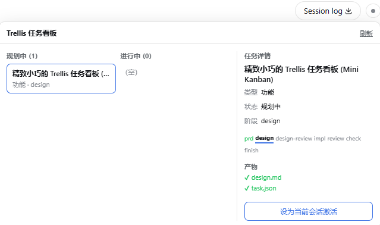
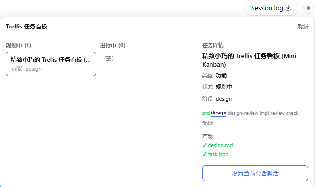
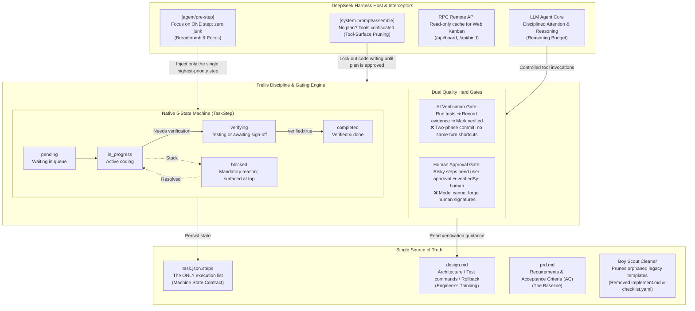

# dsh-trellis

<div align="center">
  <b style="font-size: 1.4em;">Teaching AI Agents True Engineering Discipline</b><br />
  <sub>Plan Before Coding · A Single Source of Truth · 5-State Machine · Zero Self-Certification · No Fake Tests</sub><br /><br />
  <a href="https://opensource.org/licenses/MIT"></a>
  
  
  
  
  <br /><br />
  <b>“Any fool can write code that a computer can understand. Good programmers write code that humans can understand.” — Martin Fowler</b><br />
  <i>And if an AI writes the code, it might write code that nobody understands — or blindly wipe out yesterday's work entirely.</i>
</div>

<div align="center">
  🌏 <a href="./README.md">中文</a> · <a href="./README_EN.md"><b>English</b></a>
</div>

<br />

<p align="center">
  
  
</p>

---

## ☕ Pull Up a Chair, Let's Talk Reality

It's 4:30 PM on a Friday. You're sipping fresh coffee and type a simple prompt into your AI coding assistant:

> *"Add a simple WeChat QR-code login option to our existing auth module."*

You assume the AI will act like a seasoned, professional colleague: look around the codebase, understand the architectural boundaries, sketch a quick plan, and take small, verified steps.

Ten minutes later, you stare at your terminal in sheer disbelief:
- It modified **37 different files**;
- It proudly "refactored" your database connection pool from yesterday "to improve modern concurrency patterns";
- It declares with triumphant joy: *"All finished! I wrote comprehensive tests!"*;
- You hold your breath and run `npm test` — **a wall of crimson errors fills your screen**.

That isn't agile. **That's a disaster.**

### Why does this happen?

Because Large Language Models (LLMs), by default, **lack professional engineering discipline**. They behave like an extraordinarily enthusiastic, hyper-intelligent, yet completely reckless junior intern.

You tell them: *"Don't touch code yet; think through the design first!"* They smile, nod vigorously, say *"Understood!"* — and five seconds later they've called their file-editing tools and rewritten your core domain model.

**You cannot rely on good intentions. You need rules.**

`dsh-trellis` exists for one simple purpose: **to enforce true engineering discipline on AI agents.** It takes the structured software craftsmanship philosophy of [Trellis](https://github.com/mindfold-ai/trellis) and integrates it natively into [DeepSeek Harness (DSH)](https://github.com/deepseek-ai/deepseek-harness).

---

## 📐 Architecture Overview

We reject hollow technical buzzwords. A clean architecture should be like clean code: **obvious, single-purpose, and strictly bounded**.

Here is how `dsh-trellis` governs the runtime:



> 🎨 **Want to zoom, pan, or edit the architecture diagram?**
> - 📄 **Local source file**: [`docs/images/architecture.drawio`](./docs/images/architecture.drawio) (Standard Draw.io XML)
> - 🌐 **Open in diagrams.net viewer**: [View Read-only Diagram](https://viewer.diagrams.net/?tags=%7B%7D&lightbox=1&edit=_blank#R5V1bc5tIFv4t%2B0Ct%2FWCXuAoeQUKTqcpMZuPszs6TCqG2zFgCFUKxvb9%2B%2B5zTDQ20LnYUW06clI0aaBr4ztfn2jLskWFPHldLwxp8ZeUmK3LDHhuWZV4P%2BG%2FeyvK0mGf5gpr%2F%2FWVy5cMOe2LYsTEIDXu0erzNlowfeldsKjpsXiYPWUEdtLq1vOsB9UxnWwP4b4%2FmWbIokxX%2FkCcrRsd%2BKdlymW2uwjK9yyqWVtuSUZfZnI6oxBEJP%2BLK7PYq%2B149%2FlIm67vfijmD25w%2Fijt0LHGL8ydq8X3RsCjlFcym4Sb7nxiYKQ%2FbZnO2aR1YFcWyytbtxrTIcz78VltSlsVD%2B7DbYtm%2B6jpZsF7DTZos%2B61%2FZvPqTrRag0Gz4wPLFnfi0oHcMUvS%2B0VZbHNxPcOyb%2FFH%2FwjlgyyLotq5u3naI%2F5SlJckrmlYk%2BefW99hyfJqR3d7e%2FzH1RVujJ%2F93xp8DP%2BKP%2FO%2FpmHDJcaMrW8Yu%2BebH5IyZ5sNbAHk4WIe%2F%2F1rXrEyZeuqKDcvviof8LMf0zJ5YuUUxY9ELlluBUa0ozZi1whjI5oYsWNEvhFFRuzDx2AAG6Fp%2BCMj9oxgaEQe3V6yWht2hOcGRmAZYYCdjPEUz%2FAjI%2FRwg58ewq6IdwJjuRCP6PM2r7IV6%2FT2oSjuN5c06k31JJG9echWyyTnn6JNlZSVkD3L5w2IWwZ3zl9MxEVf7PT4J05Ey1GxLErsxr4d3Doc1NBJWdwzZY%2BX%2BmwGe26LvLoRFzblZ%2BrQdMRn5TyT2XM34O1psVwm6002wzMHeDeC7Sr2uBO95j4J69EWK1asKp%2F4Z9GjI9D%2F1P74oEi%2FKSXkTpH8mrISQTmLuutjZZMfI3B3hNj1EHrH3%2FM02WzYCh5YF6SGG22eNhVbXa3LYrXmcJnUx7pjFC77MYFnHA8NP0DwDQF5vodQGxqhCxs%2BbgNAx0ZoIZRtwzdxV4C47GG36fviM0vmV0W%2BhOf9hfM4%2F%2FNHuc1Z2cdnG4MPMD3drJMU9j7wuYa33VV8ThWQ6oDST1ma6kA5813HHXRAaO0AqXLeMDFT0z8Wgm2yeDkW7TYW3T4WLR0Uh%2BeAxHXJONzWOiDyOTMHAPJDrvCYDgA94EaOJiDMMbAobwlHwJkN7lw8xhU0GJhwTGQboS9ACmjdh8So5FBMy%2B1q1qHLGxw0n2j%2B5vpEcWJgzhPm36aH2fJ4YJoz23Pnrw%2FMw8h0zhCZ5Tqd8vdXcZWyi8vPf4xgCmWrooIZNPzjV5yJ%2BQzNcTZGVIUAwQ5ThjB9A2IHyIIeQDHwkRc9aKG7gp6G2BPCm2MYFAO%2BwdFLkzvivDmY6wwjIwixnwkcz0%2FnKkRgCr2C71LADGS%2BzvjvWZGUc8MaUU%2BiLcvnp0UxM%2BcuG%2BpQHHhDO%2FGej2J7ZjLXeW0Uu8H7RPFyuZoKDu2SK6DDMcKhAA6nPdjwAZ5Aoqh48mOCGJDIUU690M4B6KnApxPDt1V4ffz4G4pGsilyMFPbhBk%2FsnRbcfPzsiUbXF4moN0CcEOhuXIcBxOUhNDwHYWyPfjIjycpCyKhNPuxTvfwQWb4CKEfB04%2Fqepwe2vpVYe5N%2FPcF2DbTe35YPDa2K4N7T3YNs8Q29zaT7nuwHVCDbg5gjhkAkSrCXZQTYYcCyGaV6SHAmFPJIXq9FnewrEDGkIAAsOfS5kB70%2FYPKvEucJAGwNvC%2FodI1TJiKsvNATARjQ8B4fnwMEhIjTEeaEtGP0hw7hiZcjUU6xYiqTU%2BDBkfyhFxYPh9yWkKw8cb1UH9AqENZD18AdMv2W2ALdSysDu5g2A3ixNlqHYURXrHSL2loqyaR%2BpKbvngPYMVU0tl3N4cRUB4D7GN%2BwDmASmHSRVAZnZskjvOeUhNS8qYuYs55JULErhkWh28LeS3T4hlbcZ2xMqNajLvqTuIe6K0YVB6FOli8A70ilDKF0kIaIfcoWEyq0prhAhVwHi2lKEMIDBRPRAfJwCyPcx%2BSmRfgTUnXOFOte%2FNThHM69B10QoD6FUf6Nd4OQItJWWGjAKNYcR9NCYlAFq4dKh5gdSUfFaohAgpXuwwY3NYCz0qsATc5A%2FFCSPvjtuKUw%2BCZ9fRL3j9CKn4J8KoF2l%2Bn0BdLdaXfNV7ZLYqbv2WdoB0hPa7FiAVkC05nb0noEu0vKEBKhCkB7iWwisCVw5tiXLkqY8Fu5lUpCFi9humJj%2FjlyhfPioRgSof4CIkKH60yG1qyJrkWq%2BFlK%2Fe4zFohiLCPnxrVEBwb5BnC%2BynL1BMIWJC3eErRkggtNEaauVZlQuQq1ZieRL6hKXMD%2FWGbWDizHjoFxlebbhmOQNfxbl%2Fe2yeOhYtb8kFZm69Hi%2BX%2FzE5Ranq7M3fWtme94L4iczxzbZucRPrODoAIr%2FuhMAyZR7dVMl6PH7LUnvSBButrOrqHh8IbhnxeN0A32uZIe62SSWnhAHNvg4hBem9iN2ZgW9r3EEQsBB%2FSXZ3AvHde%2BGjoeu04Nu3zlyqw%2F2HQVW6%2FRg7TLJyUxIx%2B3B1jW1YT%2F3bdWWTTVdsxzTR7pAq9tbRl4Uy7gJqaou0KkfndaL5sI%2FbZxDagk6bWKfhxh%2FjoWFTgZfDg3rYEg40CDDeXtgZDnY%2Fz1ctPwCPc9ULP1sY2ljeY0ji7TNcPyWUTHz1FGx06LFdA%2FDxT1LuChuoQ5idjmMBJfgJAWGN5rrwvXji9kKsmDct%2FTRm6f20Z%2BYXXz3neIlLVbrJVen5z28KHvaeBmiHy%2BAiYeim6CXk0MvQLyQgVo73O3TEo3L%2FLlzWH95BtEwx7PeCDiOeZBo%2FPMETu2t7sCm8WJfSAqhackU0xJqvt04I0CISMjE4z1wI5OTOcIwvDUQHVMIsxPCF%2F4cOp3sSa5oO8JVGFmtaBDo7RTpmQiHPFeeINIjI0lNMAe9KqEMyfrjt8xwMk%2Bd4fR9p0ytJ8bW6FjeW5iM8XwB%2BSODLMf3ScZW%2FRxeZDOy6XpaFdOshxHGryVfWlFWd8WiyJNl3LR2DLbmmI8FeNmw8W9WVU8CCsm2KtrI2q100R6Z92zV2IBBPQsZ%2FJaKbZkyvcXCTdAFqzRK6wsAVbJlUmVf28N7K6Zj0wze6ld9JFvGI7qqk8wcAg8zJfieASZqxaqPCZVnBnvcwqfCjmrUdKDTUmDfP3q%2BAnpSvTKewesNq3LLzgIftf70bHzUHqBT4aNjxXQg0tJZfxCCmWkIpqc9nQNKat2kjRLzMErqM1%2BBRRTt9P0DZKboFZ0Z6IB6ekaqxxEAqc9kj1n1X3AhX1vi01%2FCocwBUj4pu%2BDjX6L3U8GqZdn8KIoNqb3jbQLQ%2Bg%2FOPmkCGZ8UJ0Nl%2BNtjJotEl5Yt8jMoq4P0IfAaOO1cuL4WRZHDkS7QPbgQt%2FIv%2FiernuRdvEqgpO2hOj5QUnuo3jxQ4g4PR0qsc4yUAMCmSZ8LQ8r09wFMVFgHmf6%2BqDEB73e9ywNXph%2FpUfVVlQyMtf8zyf7Z9laQ%2B9zROEibBDhMFsGk1IsvD8XVH3fJhmG4frXKqssm9a7p17wWdxANZSkMDZOqBzDaw9vBo0%2BpqU47WUrmkVLdjMgPFHfye0ECrshWXa5QD8C6FulPIksGA0rhSJOrrcnnli4YeV3UbIE%2BQbkVdxspyb%2BUHDbBql%2BdmxETtvyRSCDo5v7qCimbNEuqMtKNWqSf1VBQ7LUaN9%2FRdbknorYrRiLzcJbsFjJ5NvxSXCv%2BiJ9oDj3a1VNz88mCaHafNRxfl49%2BDqRxt10leY83PlCrlFjhcRw2YXuRQO6gnNcTEsItxCmKT2Yc0HrqwGt22EOXFdBk1oZNZm1oKlmzeAzkme8kjj1VdQFkUEJyJbFSLFMpaRqmdPOB4UbGZAA%2BUX4KMpeSaFnLkCezd%2BusHh9%2B8%2BPdscJHRJFuQ639whXYNWwLH7pmQ18WWUc6cuoST61Q1JekhKGR2KCnSC%2ByIafoqZUrVb%2Bqb%2BKg%2Fi1iBRjV00LGkxZlQ8BDFEun87hduDASPAWp20O8ViD5c4jDUB8wvX%2B8bX8o3kw0aHPsq4TwdvqvD9PZN3u0T09zpvWWPPfdcwptIqubqihhIQ25SsMNfzG4XMkNWUfWoLjF1MMtfwavn2i4kcPbndZLSbSySlOkZklh5TJHBT8iz9wF0hBcE6NIDaETEvfWOg4qPTmYd%2BsAPVFGo6iXl2lcoroBnt%2FFoQeo1iuz5e3VB8alI198vyzFFP4dzuc5Pkuxzuc5iyxFzzw6S9F%2B4zT1NCnn0yrZ3P%2BNocwOpGHHNey5hsL6TatIGGYJB6shFLSTpgogjLEks7Z5FFhCZNPXZSCiuRCYdTLuZXcOxBqIs91oDxZmWUuXiQm2lCkz%2F0HGL8ANtN1c7uhAp%2F3Vcy4KeYBKX5LCQjZJnrIjeqrNjXo1GUeUEkBPGRw8hLGhLrK7v54NB3qaDTTW0ULR7HvTsnFdzHq%2FDmA9zxmiTAvfM21UW%2BxingWNzNmGP89VPxGDdlyv5l0CCScS11QERWrmSJgQkKSxh1JUvdUXSyFAIhDWroC42T8EgYhbF7kk9Ax6mkJT4N5bBaKmnF3dd2lX1rChjQWFa067%2BzH6MtC%2BIBODCt6oTsgfP4N8yGAzJY1ZlKkjHTJkYojFB2TZctfvhKV1vne55%2B5EpTOZZzQOquegJJtAXN6XD1g4zeR6Abx%2FyhYCIIaiho%2BWG6Cq8TPLXT1HUnvPrLYu5xpK4609PkPQBGGzuItaHip8Ay4W3IWKG6WGmo%2BeEFtgLnJ%2BEPbqPxUf7lLwfqBokLHOu0N1sVQ0js4U%2FXV%2BzaFqdltJ2%2BYmLdZMGk2tx7pvoJEsDg6FS60uWAdf7EQk6FHhZFcnq50dUjnjZBaOLvex%2BvGrT%2FQrmNHyEytIhJIKHalH05I%2B55Xren7EdETs6ayJaZvrsut1fgIqz6GqxrApb%2FRtxVdYLyTVcyooLKf6B8Rye%2BQp%2BBGoypUrB9BTcoVmEA7UpV0ycGCuOBzb%2FP%2BCntI7lt4vs011%2FZTAer47iQLUpYlSLE50FCjKjc4pDJTqKi2%2BUg3YfuO7rxx5sryb0pHrXmtXlxJPF4E%2FdaGNSJqrWHoujMzg3HKXDzPTCdZvPAlj%2Bc5hxnLPkbHE3U9nRVUVq2mOy%2BLpHKguLkdQL4cgo1qNjo5hhihCv2Yxumwvc3SEjwkQSOk0wrfVCl4fMinVHhqzthNuamk7uJ5TGLcUBNmD1CIH2AMuDWUNlNWh1MUYhooVY%2B2VO93pYkKgxaXwyQQY1xIt8TMXbNCllOCPbsEGVdzOwKli6mrIB57OO%2Fuuoiijz59ubq5kLGX06fff49GXT59vXjVEAjlv07RaftOia72A5hlnm1qHlzKpz2ySCV0lmdDsJBO6ajbhkUmqZj99ULOAs5pBeKKSm%2FPKT5Xg27kGmrrc3kQEJiJHLqc%2BlApxJy2itxbwmdfVHMBjXc58FB6Hp8RjaxnnnwaOu5eBOrgYqSYTRV3VV5ukI7PbwvF7KvbZV0f9qkDtrIfbRem3ZHWcHzw3T3k6FcFdHVuOZJQwkGafDL50g7890%2FAdFRKZewqJ9BUAHeydCHr6ogAVgb14%2FY%2BDwl0Z%2B%2F24UT8MhJ4MSrmj9JqfaYY%2BIfiUd9BDnRrefSeow8N2fAmS6EL5pqn2F1zxvfI7ruT3ZuEJ%2BNVZdvx%2F)
> - ✏️ **Edit live in diagrams.net**: [Edit a Copy Online](https://app.diagrams.net/?grid=0&pv=0&border=10&edit=_blank#create=%7B%22type%22%3A%20%22xml%22%2C%20%22compressed%22%3A%20true%2C%20%22data%22%3A%20%225V1bc5tIFv4t%2B0Ct%2FWCXuAoeQUKTqcpMZuPszs6TCqG2zFgCFUKxvb9%2B%2B5zTDQ20LnYUW06clI0aaBr4ztfn2jLskWFPHldLwxp8ZeUmK3LDHhuWZV4P%2BG%2FeyvK0mGf5gpr%2F%2FWVy5cMOe2LYsTEIDXu0erzNlowfeldsKjpsXiYPWUEdtLq1vOsB9UxnWwP4b4%2FmWbIokxX%2FkCcrRsd%2BKdlymW2uwjK9yyqWVtuSUZfZnI6oxBEJP%2BLK7PYq%2B149%2FlIm67vfijmD25w%2Fijt0LHGL8ydq8X3RsCjlFcym4Sb7nxiYKQ%2FbZnO2aR1YFcWyytbtxrTIcz78VltSlsVD%2B7DbYtm%2B6jpZsF7DTZos%2B61%2FZvPqTrRag0Gz4wPLFnfi0oHcMUvS%2B0VZbHNxPcOyb%2FFH%2FwjlgyyLotq5u3naI%2F5SlJckrmlYk%2BefW99hyfJqR3d7e%2FzH1RVujJ%2F93xp8DP%2BKP%2FO%2FpmHDJcaMrW8Yu%2BebH5IyZ5sNbAHk4WIe%2F%2F1rXrEyZeuqKDcvviof8LMf0zJ5YuUUxY9ELlluBUa0ozZi1whjI5oYsWNEvhFFRuzDx2AAG6Fp%2BCMj9oxgaEQe3V6yWht2hOcGRmAZYYCdjPEUz%2FAjI%2FRwg58ewq6IdwJjuRCP6PM2r7IV6%2FT2oSjuN5c06k31JJG9echWyyTnn6JNlZSVkD3L5w2IWwZ3zl9MxEVf7PT4J05Ey1GxLErsxr4d3Doc1NBJWdwzZY%2BX%2BmwGe26LvLoRFzblZ%2BrQdMRn5TyT2XM34O1psVwm6002wzMHeDeC7Sr2uBO95j4J69EWK1asKp%2F4Z9GjI9D%2F1P74oEi%2FKSXkTpH8mrISQTmLuutjZZMfI3B3hNj1EHrH3%2FM02WzYCh5YF6SGG22eNhVbXa3LYrXmcJnUx7pjFC77MYFnHA8NP0DwDQF5vodQGxqhCxs%2BbgNAx0ZoIZRtwzdxV4C47GG36fviM0vmV0W%2BhOf9hfM4%2F%2FNHuc1Z2cdnG4MPMD3drJMU9j7wuYa33VV8ThWQ6oDST1ma6kA5813HHXRAaO0AqXLeMDFT0z8Wgm2yeDkW7TYW3T4WLR0Uh%2BeAxHXJONzWOiDyOTMHAPJDrvCYDgA94EaOJiDMMbAobwlHwJkN7lw8xhU0GJhwTGQboS9ACmjdh8So5FBMy%2B1q1qHLGxw0n2j%2B5vpEcWJgzhPm36aH2fJ4YJoz23Pnrw%2FMw8h0zhCZ5Tqd8vdXcZWyi8vPf4xgCmWrooIZNPzjV5yJ%2BQzNcTZGVIUAwQ5ThjB9A2IHyIIeQDHwkRc9aKG7gp6G2BPCm2MYFAO%2BwdFLkzvivDmY6wwjIwixnwkcz0%2FnKkRgCr2C71LADGS%2BzvjvWZGUc8MaUU%2BiLcvnp0UxM%2BcuG%2BpQHHhDO%2FGej2J7ZjLXeW0Uu8H7RPFyuZoKDu2SK6DDMcKhAA6nPdjwAZ5Aoqh48mOCGJDIUU690M4B6KnApxPDt1V4ffz4G4pGsilyMFPbhBk%2FsnRbcfPzsiUbXF4moN0CcEOhuXIcBxOUhNDwHYWyPfjIjycpCyKhNPuxTvfwQWb4CKEfB04%2Fqepwe2vpVYe5N%2FPcF2DbTe35YPDa2K4N7T3YNs8Q29zaT7nuwHVCDbg5gjhkAkSrCXZQTYYcCyGaV6SHAmFPJIXq9FnewrEDGkIAAsOfS5kB70%2FYPKvEucJAGwNvC%2FodI1TJiKsvNATARjQ8B4fnwMEhIjTEeaEtGP0hw7hiZcjUU6xYiqTU%2BDBkfyhFxYPh9yWkKw8cb1UH9AqENZD18AdMv2W2ALdSysDu5g2A3ixNlqHYURXrHSL2loqyaR%2BpKbvngPYMVU0tl3N4cRUB4D7GN%2BwDmASmHSRVAZnZskjvOeUhNS8qYuYs55JULErhkWh28LeS3T4hlbcZ2xMqNajLvqTuIe6K0YVB6FOli8A70ilDKF0kIaIfcoWEyq0prhAhVwHi2lKEMIDBRPRAfJwCyPcx%2BSmRfgTUnXOFOte%2FNThHM69B10QoD6FUf6Nd4OQItJWWGjAKNYcR9NCYlAFq4dKh5gdSUfFaohAgpXuwwY3NYCz0qsATc5A%2FFCSPvjtuKUw%2BCZ9fRL3j9CKn4J8KoF2l%2Bn0BdLdaXfNV7ZLYqbv2WdoB0hPa7FiAVkC05nb0noEu0vKEBKhCkB7iWwisCVw5tiXLkqY8Fu5lUpCFi9humJj%2FjlyhfPioRgSof4CIkKH60yG1qyJrkWq%2BFlK%2Fe4zFohiLCPnxrVEBwb5BnC%2BynL1BMIWJC3eErRkggtNEaauVZlQuQq1ZieRL6hKXMD%2FWGbWDizHjoFxlebbhmOQNfxbl%2Fe2yeOhYtb8kFZm69Hi%2BX%2FzE5Ranq7M3fWtme94L4iczxzbZucRPrODoAIr%2FuhMAyZR7dVMl6PH7LUnvSBButrOrqHh8IbhnxeN0A32uZIe62SSWnhAHNvg4hBem9iN2ZgW9r3EEQsBB%2FSXZ3AvHde%2BGjoeu04Nu3zlyqw%2F2HQVW6%2FRg7TLJyUxIx%2B3B1jW1YT%2F3bdWWTTVdsxzTR7pAq9tbRl4Uy7gJqaou0KkfndaL5sI%2FbZxDagk6bWKfhxh%2FjoWFTgZfDg3rYEg40CDDeXtgZDnY%2Fz1ctPwCPc9ULP1sY2ljeY0ji7TNcPyWUTHz1FGx06LFdA%2FDxT1LuChuoQ5idjmMBJfgJAWGN5rrwvXji9kKsmDct%2FTRm6f20Z%2BYXXz3neIlLVbrJVen5z28KHvaeBmiHy%2BAiYeim6CXk0MvQLyQgVo73O3TEo3L%2FLlzWH95BtEwx7PeCDiOeZBo%2FPMETu2t7sCm8WJfSAqhackU0xJqvt04I0CISMjE4z1wI5OTOcIwvDUQHVMIsxPCF%2F4cOp3sSa5oO8JVGFmtaBDo7RTpmQiHPFeeINIjI0lNMAe9KqEMyfrjt8xwMk%2Bd4fR9p0ytJ8bW6FjeW5iM8XwB%2BSODLMf3ScZW%2FRxeZDOy6XpaFdOshxHGryVfWlFWd8WiyJNl3LR2DLbmmI8FeNmw8W9WVU8CCsm2KtrI2q100R6Z92zV2IBBPQsZ%2FJaKbZkyvcXCTdAFqzRK6wsAVbJlUmVf28N7K6Zj0wze6ld9JFvGI7qqk8wcAg8zJfieASZqxaqPCZVnBnvcwqfCjmrUdKDTUmDfP3q%2BAnpSvTKewesNq3LLzgIftf70bHzUHqBT4aNjxXQg0tJZfxCCmWkIpqc9nQNKat2kjRLzMErqM1%2BBRRTt9P0DZKboFZ0Z6IB6ekaqxxEAqc9kj1n1X3AhX1vi01%2FCocwBUj4pu%2BDjX6L3U8GqZdn8KIoNqb3jbQLQ%2Bg%2FOPmkCGZ8UJ0Nl%2BNtjJotEl5Yt8jMoq4P0IfAaOO1cuL4WRZHDkS7QPbgQt%2FIv%2FiernuRdvEqgpO2hOj5QUnuo3jxQ4g4PR0qsc4yUAMCmSZ8LQ8r09wFMVFgHmf6%2BqDEB73e9ywNXph%2FpUfVVlQyMtf8zyf7Z9laQ%2B9zROEibBDhMFsGk1IsvD8XVH3fJhmG4frXKqssm9a7p17wWdxANZSkMDZOqBzDaw9vBo0%2BpqU47WUrmkVLdjMgPFHfye0ECrshWXa5QD8C6FulPIksGA0rhSJOrrcnnli4YeV3UbIE%2BQbkVdxspyb%2BUHDbBql%2BdmxETtvyRSCDo5v7qCimbNEuqMtKNWqSf1VBQ7LUaN9%2FRdbknorYrRiLzcJbsFjJ5NvxSXCv%2BiJ9oDj3a1VNz88mCaHafNRxfl49%2BDqRxt10leY83PlCrlFjhcRw2YXuRQO6gnNcTEsItxCmKT2Yc0HrqwGt22EOXFdBk1oZNZm1oKlmzeAzkme8kjj1VdQFkUEJyJbFSLFMpaRqmdPOB4UbGZAA%2BUX4KMpeSaFnLkCezd%2BusHh9%2B8%2BPdscJHRJFuQ639whXYNWwLH7pmQ18WWUc6cuoST61Q1JekhKGR2KCnSC%2ByIafoqZUrVb%2Bqb%2BKg%2Fi1iBRjV00LGkxZlQ8BDFEun87hduDASPAWp20O8ViD5c4jDUB8wvX%2B8bX8o3kw0aHPsq4TwdvqvD9PZN3u0T09zpvWWPPfdcwptIqubqihhIQ25SsMNfzG4XMkNWUfWoLjF1MMtfwavn2i4kcPbndZLSbSySlOkZklh5TJHBT8iz9wF0hBcE6NIDaETEvfWOg4qPTmYd%2BsAPVFGo6iXl2lcoroBnt%2FFoQeo1iuz5e3VB8alI198vyzFFP4dzuc5Pkuxzuc5iyxFzzw6S9F%2B4zT1NCnn0yrZ3P%2BNocwOpGHHNey5hsL6TatIGGYJB6shFLSTpgogjLEks7Z5FFhCZNPXZSCiuRCYdTLuZXcOxBqIs91oDxZmWUuXiQm2lCkz%2F0HGL8ANtN1c7uhAp%2F3Vcy4KeYBKX5LCQjZJnrIjeqrNjXo1GUeUEkBPGRw8hLGhLrK7v54NB3qaDTTW0ULR7HvTsnFdzHq%2FDmA9zxmiTAvfM21UW%2BxingWNzNmGP89VPxGDdlyv5l0CCScS11QERWrmSJgQkKSxh1JUvdUXSyFAIhDWroC42T8EgYhbF7kk9Ax6mkJT4N5bBaKmnF3dd2lX1rChjQWFa067%2BzH6MtC%2BIBODCt6oTsgfP4N8yGAzJY1ZlKkjHTJkYojFB2TZctfvhKV1vne55%2B5EpTOZZzQOquegJJtAXN6XD1g4zeR6Abx%2FyhYCIIaiho%2BWG6Cq8TPLXT1HUnvPrLYu5xpK4609PkPQBGGzuItaHip8Ay4W3IWKG6WGmo%2BeEFtgLnJ%2BEPbqPxUf7lLwfqBokLHOu0N1sVQ0js4U%2FXV%2BzaFqdltJ2%2BYmLdZMGk2tx7pvoJEsDg6FS60uWAdf7EQk6FHhZFcnq50dUjnjZBaOLvex%2BvGrT%2FQrmNHyEytIhJIKHalH05I%2B55Xren7EdETs6ayJaZvrsut1fgIqz6GqxrApb%2FRtxVdYLyTVcyooLKf6B8Rye%2BQp%2BBGoypUrB9BTcoVmEA7UpV0ycGCuOBzb%2FP%2BCntI7lt4vs011%2FZTAer47iQLUpYlSLE50FCjKjc4pDJTqKi2%2BUg3YfuO7rxx5sryb0pHrXmtXlxJPF4E%2FdaGNSJqrWHoujMzg3HKXDzPTCdZvPAlj%2Bc5hxnLPkbHE3U9nRVUVq2mOy%2BLpHKguLkdQL4cgo1qNjo5hhihCv2Yxumwvc3SEjwkQSOk0wrfVCl4fMinVHhqzthNuamk7uJ5TGLcUBNmD1CIH2AMuDWUNlNWh1MUYhooVY%2B2VO93pYkKgxaXwyQQY1xIt8TMXbNCllOCPbsEGVdzOwKli6mrIB57OO%2Fuuoiijz59ubq5kLGX06fff49GXT59vXjVEAjlv07RaftOia72A5hlnm1qHlzKpz2ySCV0lmdDsJBO6ajbhkUmqZj99ULOAs5pBeKKSm%2FPKT5Xg27kGmrrc3kQEJiJHLqc%2BlApxJy2itxbwmdfVHMBjXc58FB6Hp8RjaxnnnwaOu5eBOrgYqSYTRV3VV5ukI7PbwvF7KvbZV0f9qkDtrIfbRem3ZHWcHzw3T3k6FcFdHVuOZJQwkGafDL50g7890%2FAdFRKZewqJ9BUAHeydCHr6ogAVgb14%2FY%2BDwl0Z%2B%2F24UT8MhJ4MSrmj9JqfaYY%2BIfiUd9BDnRrefSeow8N2fAmS6EL5pqn2F1zxvfI7ruT3ZuEJ%2BNVZdvx%2F%22%7D)

---

## 🛠️ The 5 Golden Rules of Engineering Discipline

In software engineering, **discipline beats passion every time.** We enforce five unbendable rules to keep AI assistants from wreaking havoc on your repository.

### Rule 1: No Approved Plan? Tools Confiscated. (Physical Read-Only)

Many developers write essays in system prompts: *"Please be very careful! Do not edit code until the plan is approved!"*

**That never works.** In complex sessions, the model's autoregressive nature compells it to guess implementation details. It promises obedience, but reaches for the `write` tool anyway.

Our approach is unapologetically physical:
- When a task is in a planning stage (`prd`, `design`, `scan`), the engine **physically strips `write` and `edit` tools from the model's tool list**;
- The model is handed only a magnifying glass (`read`, `grep`, `glob`) and a sandboxed pad (`trellis_artifact_update`);
- It cannot edit code because the tools literally do not exist. It has no choice but to spend 100% of its reasoning budget on research and architecture.

### Rule 2: A Man with Two Watches Never Knows the Time (Single Source of Truth)

Past workflow systems made an amateur mistake:
- Feature workflows kept a checklist in `implement.md`;
- Refactor workflows maintained private checklists in `checklist.yaml`;
- The root `task.json` had its own list of steps.

**This is the Two Lists Problem.** The AI ticks off an item here, deletes one there, and soon neither you nor the AI knows what is actually done.

We converged the architecture:
1. **There is only ONE list**: Everything lives in `task.json.steps`. It is the sole machine-state contract;
2. **Strict Separation of Concerns (SoC)**:
   - Machine State belongs in `task.json` (statuses, verification requirements, owners);
   - Engineering Thinking belongs in `design.md` (data flow, test command lists, rollback strategies);
   - Requirements belong in `prd.md` (what user problem we are solving, acceptance criteria);
3. **The Boy Scout Rule**:
   What happens to orphan templates when an old project upgrades to the new plugin? The engine cleans them up automatically on launch (**Self-Healing Pruning**). It leaves the campsite cleaner than it found it, and **never touches any historical task data**.

### Rule 3: Self-Certification Is Meaningless (5-State Machine & Dual Gates)

When an AI finishes typing code, is the step done?

In naive setups, the AI declares: *"I wrote the code and it looks great to me. Closing step!"* That's self-deception.

We enforce a **5-state step machine** with mandatory **Two-Phase Commits**:

| State | Plain-English Meaning | Gate Constraint |
|---|---|---|
| `pending` | Waiting in the backlog queue | Cannot start until prior steps finish |
| `in_progress` | Heads-down coding | Strictly confined to this step; no jumping ahead |
| `verifying` | **Coding complete, but NOT closed!** Awaiting proof | **Must stop and verify**. AI runs test suite; Human awaits user approval |
| `blocked` | **Hit a roadblock!** | **Mandatory blockedReason**; surfaced at the top of every subsequent prompt |
| `completed` | Verified by objective criteria | **Two-phase commit**: verification must be recorded first; closed in next turn |

#### For AI Self-Tests (`verification: 'ai'`):
The model **cannot** mark `verified: true` and `status: 'completed'` in the same turn. It must execute the test commands, record the output in `verificationNotes`, save state, and only close the step on the following turn.

#### For Human Approval Gates (`verification: 'human'`):
For core refactorings, breaking contract changes, or destructive operations:
**The tool layer physically blocks model self-certification.** Unless a human explicitly approves in the chat and sets `verifiedBy: 'human'`, the step cannot reach `completed`. The machine cannot forge a human signature.

### Rule 4: Don't Shove an Encyclopedia in the Chef's Face (High-SNR Attention)

If you order scrambled eggs, you don't recite the entire menu of 100 dishes to the chef first.

In long sessions, naive tools dump massive global checklists and old artifacts into every prompt turn. The context fills with noise, and reasoning capacity plummets.

Our attention management rule is: **Focus solely on the active step.**
1. **Priority Queue Selection**:
   $$\mathbf{blocked (Blockers First)} \succ \mathbf{in\_progress (Active Coding)} \succ \mathbf{verifying (Testing)} \succ \mathbf{pending}$$
   If work is blocked, the engine surfaces the roadblock first. If coding is ongoing, it shows only the current step's acceptance criteria;
2. **In-Memory Deduplication**:
   If a step remains in the same state across turns, prompt injection degrades to a concise one-line reminder with **0 disk I/O**, saving context tokens for actual code.

### Rule 5: Parallel Sessions Never Collide (Per-Session Pointer Isolation)

You open three terminal windows: one developing a feature, one fixing an urgent bug, and one running load tests.

If the plugin used a global singleton for the "active task", all three windows would overwrite each other's progress.

We enforce **Per-Session Pointer Isolation**:
Each window maintains its own pointer in `.trellis/.runtime/sessions/<session-id>.json`. Window A never knows or corrupts what Window B is doing.

---

## ⚡ Quick Start: 3 Steps to Discipline

### Step 1: Install Plugin

Ensure Node.js ≥ 20 is installed, then run:

```sh
# Install release
dsh plugin --profile web add @banana-peeljj12/dsh-trellis

# Update anytime
dsh plugin --profile web add @banana-peeljj12/dsh-trellis@latest
```

After installation, **restart the DSH server once**.

### Step 2: Add Project to Allowlist

For safety, Trellis never intercepts unauthorized folders.

1. Refresh the DSH web browser;
2. Go to **Settings → Plugins → Trellis Workflow** on the left menu;
3. Add your project root absolute path (e.g., `D:/code/my-project` or `/home/user/project`) to **Allowlist Projects**. Saves take effect immediately.

### Step 3: Converse Normally

State your goal naturally to your AI:
> *"Add an Excel export button to the order management table."*

The AI will follow professional discipline:
1. Recognizes intent, requests permission to scaffold `feat-09-06-export-excel`;
2. Enters read-only planning, studying your existing code to draft `prd.md` and `design.md`;
3. Breaks work into clear `steps` (which ones need unit tests, which need your eyes);
4. Upon your approval, writes code, runs verification, and archives cleanly when all gates pass!

---

## 🧭 Three Standard Workflow Paths

| Scenario | Skill | Stages | Why This Way? |
|---|---|---|---|
| **New Features & Enhancements** | `trellis-feat` | `prd` → `design` → `design-review` → `impl` → `review` → `check` | Look before you leap. Supports `quick` (fast-track) and `standard` (formal dual review) |
| **Bug Fixes & Regressions** | `trellis-issue` | `report` → `analyze` → `fix` → `fix-note` | Never blindly patch symptoms. Pinpoint repro steps and root causes; loops trigger `trellis-break-loop` |
| **Refactoring & Cleanup** | `trellis-refactor` | `scan` → `design` → `apply` → `done` | **Zero behavioral changes permitted!** Driven purely by verified steps; functional changes route to feat |

---

## ⚙️ Configuration Reference

Configure via Web Settings (**Settings → Plugins → Trellis Workflow**) or `~/.dsh/settings.yaml`:

| Key | Type | Default | Plain-English Explanation |
|---|---|---|---|
| `allowlist` | `string[]` | `[]` | **Security Allowlist**: Absolute paths to active projects. Anything outside is ignored |
| `enforceReadonlyPlanning` | `boolean` | `false` | **Read-only Master Switch**: When enabled, physically removes write tools during planning |
| `skipKeywords` | `string[]` | `['no-trellis']` | **Emergency Escape Hatch**: If a message contains this word, Trellis steps aside completely |
| `injectStep` | `number` | `1` | Turn step index where breadcrumbs inject (default: first step only) |

---

## 📂 Clean Package Layout

Following Separation of Concerns:

```text
dsh-trellis/
├── lib/
│   ├── index.js            # Main registrar: mounts DSH hooks, assemble pruning & RPC routes
│   ├── task.js             # Engine core: 5-state transitions, dual verification gates, completion check
│   ├── skills.js           # Skills provider: auto-copies skills and safely prunes orphan templates
│   ├── breadcrumb.js       # Prompt builder: priority queue selection & tiered prompt formatting
│   ├── readonly.js         # Permission decider: translates task stages to authorization states
│   ├── state.js            # State machine: phase derivation, per-session isolation & archive keys
│   ├── artifact.js         # Controlled writer: safe deliverable updates with traversal defense
│   ├── archive.js          # Archiver: git cleanliness checks and atomic directory moves
│   ├── board.js            # Kanban provider: pure in-memory aggregation of active & archived tasks
│   ├── client.js           # Web frontend: stage chip, Mini Kanban modal & settings tab
│   └── types/index.d.ts    # TypeScript interface contracts
├── skills/                 # 15 bundled workflow skills and templates
├── docs/images/            # Screenshots and architecture.drawio source diagram
└── test/                   # 72+ native automated tests ensuring zero regressions
```

---

## 🤝 Acknowledgements

- **[Trellis](https://github.com/mindfold-ai/trellis)** (Mindfold): Created the structured engineering workflow concept. We re-architected its semantics natively on DSH primitives in pure Node.js ESM without any AGPL code, released freely under MIT.
- **[CodeStable](https://github.com/codestable/CodeStable)**: Inspired the three-path workflow routing philosophy.
- **[DeepSeek Harness](https://github.com/deepseek-ai/deepseek-harness)**: The extensible, powerful AI Agent runtime.

---

## 📄 License

Open-sourced under the [MIT License](./LICENSE). True craftsmen value reliability, and respect freedom.
